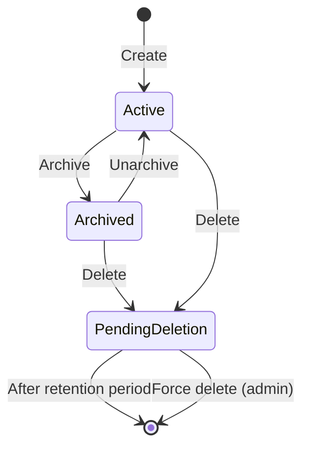

# Admin Portal, RBAC, Auth Providers & Agent Deployment

## Current State Analysis

**Authentication:**

- Password login exists at `POST /auth/login` with JWT (HS256)
- Admin flag (`is_admin`) on users grants `["*"]` permissions in JWT
- No password change/reset API (only `UserRepo::update_password` exists in store layer)
- OIDC validator exists in `met-secrets` crate but not wired to `met-api`

**Authorization:**

- RBAC helpers exist in `[crates/met-api/src/auth/rbac.rs](crates/met-api/src/auth/rbac.rs)` but are unused in route handlers
- Permission constants defined but routes don't call `require_permission`
- Groups schema exists in DB but no repository or API routes

**Tokens:**

- API tokens (`met_`*) are stubbed - always return "not implemented"
- No `api_tokens` table in migrations
- Join tokens for agents exist with project/pipeline scoping

**Frontend:**

- Admin routes under `/settings` and `/settings/security` with mock data
- No `/admin` subpath or admin-only protection

---

## Phase 0: Project CRUD & Lifecycle

### 0.1 Missing Project Routes

The `ProjectRepo` exists in `met-store` but no HTTP routes expose it. Create `crates/met-api/src/routes/projects.rs`:

```rust
GET    /api/v1/projects
POST   /api/v1/projects
GET    /api/v1/projects/{id}
GET    /api/v1/projects/by-slug/{slug}
PATCH  /api/v1/projects/{id}
DELETE /api/v1/projects/{id}  // Soft delete (sets deleted_at)
```

### 0.2 Project Lifecycle Schema

Add to migration `003_rbac_system.sql`:

```sql
-- Add lifecycle columns to projects
ALTER TABLE projects 
    ADD COLUMN IF NOT EXISTS archived_at TIMESTAMPTZ,
    ADD COLUMN IF NOT EXISTS scheduled_deletion_at TIMESTAMPTZ;

CREATE INDEX idx_projects_archived ON projects(org_id, archived_at) WHERE archived_at IS NOT NULL;
CREATE INDEX idx_projects_scheduled_deletion ON projects(scheduled_deletion_at) WHERE scheduled_deletion_at IS NOT NULL;

-- Platform settings table
CREATE TABLE platform_settings (
    key TEXT PRIMARY KEY,
    value JSONB NOT NULL,
    updated_at TIMESTAMPTZ NOT NULL DEFAULT NOW(),
    updated_by UUID REFERENCES users(id)
);

-- Default deletion retention: 7 days
INSERT INTO platform_settings (key, value) VALUES 
    ('project_deletion_retention_days', '7');
```

### 0.3 Project Lifecycle States




### 0.4 Project Admin API

```rust
// Standard operations
POST   /api/v1/projects/{id}/archive
POST   /api/v1/projects/{id}/unarchive

// Admin deletion operations
POST   /admin/projects/{id}/schedule-deletion   // Sets scheduled_deletion_at
POST   /admin/projects/{id}/cancel-deletion     // Clears scheduled_deletion_at  
POST   /admin/projects/{id}/force-delete        // Immediate permanent deletion
```

### 0.5 Deletion Worker

Background task that runs periodically:

```rust
async fn process_scheduled_deletions(pool: &PgPool) -> Result<()> {
    let projects = sqlx::query_as::<_, Project>(
        "SELECT * FROM projects WHERE scheduled_deletion_at <= NOW()"
    ).fetch_all(pool).await?;
    
    for project in projects {
        permanently_delete_project(project.id).await?;
    }
    Ok(())
}
```

### 0.6 Cascade Deletion (Data Garbage Collection)

When a project is permanently deleted, ALL associated data must be removed:

**Database Cascade (via FK constraints or explicit deletion):**


| Table                | Cascade Path                                                        |
| -------------------- | ------------------------------------------------------------------- |
| `pipelines`          | `project_id` -> deleted                                             |
| `jobs`               | via `pipeline_id` -> deleted                                        |
| `steps`              | via `job_id` -> deleted                                             |
| `triggers`           | via `pipeline_id` -> deleted                                        |
| `runs`               | via `pipeline_id` -> deleted                                        |
| `job_runs`           | via `run_id` -> deleted                                             |
| `step_runs`          | via `job_run_id` -> deleted                                         |
| `artifacts`          | via `run_id` -> deleted                                             |
| `secrets`            | `project_id` -> deleted                                             |
| `variables`          | `project_id` -> deleted                                             |
| `reusable_workflows` | `project_id` -> deleted                                             |
| `join_tokens`        | where `scope='project'` and `scope_id` = project -> deleted         |
| `api_tokens`         | where `project_ids` contains project -> remove from array or revoke |


**External Storage Cleanup:**

```rust
async fn permanently_delete_project(project_id: ProjectId, pool: &PgPool, storage: &Storage) -> Result<()> {
    // 1. Get all artifact storage paths before deletion
    let artifacts = sqlx::query_scalar::<_, String>(
        "SELECT a.storage_path FROM artifacts a
         JOIN runs r ON a.run_id = r.id
         JOIN pipelines p ON r.pipeline_id = p.id
         WHERE p.project_id = $1"
    ).bind(project_id).fetch_all(pool).await?;
    
    // 2. Get all log paths
    let logs = sqlx::query_scalar::<_, Option<String>>(
        "SELECT jr.log_path FROM job_runs jr
         JOIN runs r ON jr.run_id = r.id
         JOIN pipelines p ON r.pipeline_id = p.id
         WHERE p.project_id = $1 AND jr.log_path IS NOT NULL"
    ).bind(project_id).fetch_all(pool).await?;
    
    // 3. Delete from object storage (SeaweedFS)
    for path in artifacts.into_iter().chain(logs.into_iter().flatten()) {
        storage.delete(&path).await.ok(); // Best-effort cleanup
    }
    
    // 4. Delete project row (cascades to all child tables)
    sqlx::query("DELETE FROM projects WHERE id = $1")
        .bind(project_id)
        .execute(pool)
        .await?;
    
    Ok(())
}
```

**Ensure CASCADE constraints exist** (verify in migration):

```sql
-- These should already exist but verify:
ALTER TABLE pipelines DROP CONSTRAINT IF EXISTS pipelines_project_id_fkey;
ALTER TABLE pipelines ADD CONSTRAINT pipelines_project_id_fkey 
    FOREIGN KEY (project_id) REFERENCES projects(id) ON DELETE CASCADE;

ALTER TABLE secrets DROP CONSTRAINT IF EXISTS secrets_project_id_fkey;
ALTER TABLE secrets ADD CONSTRAINT secrets_project_id_fkey 
    FOREIGN KEY (project_id) REFERENCES projects(id) ON DELETE CASCADE;

ALTER TABLE variables DROP CONSTRAINT IF EXISTS variables_project_id_fkey;
ALTER TABLE variables ADD CONSTRAINT variables_project_id_fkey 
    FOREIGN KEY (project_id) REFERENCES projects(id) ON DELETE CASCADE;

ALTER TABLE reusable_workflows DROP CONSTRAINT IF EXISTS reusable_workflows_project_id_fkey;
ALTER TABLE reusable_workflows ADD CONSTRAINT reusable_workflows_project_id_fkey 
    FOREIGN KEY (project_id) REFERENCES projects(id) ON DELETE CASCADE;
```

---

## Phase 1: Admin Portal Foundation

### 1.1 Password Management API

Add endpoints to `[crates/met-api/src/routes/auth.rs](crates/met-api/src/routes/auth.rs)`:

```rust
POST /auth/change-password  { current_password, new_password }
POST /admin/users/{id}/reset-password  { new_password }  // admin-only
```

### 1.2 Admin Route Structure

Create new frontend route group under `/admin`:

```
frontend/src/routes/admin/
  +layout.svelte          # Admin layout with auth guard
  +page.svelte            # Dashboard
  users/+page.svelte      # User management
  groups/+page.svelte     # Group management  
  auth/+page.svelte       # OIDC/GitHub config
  tokens/+page.svelte     # API token management
```

Update `[frontend/src/lib/components/layout/Sidebar.svelte](frontend/src/lib/components/layout/Sidebar.svelte)` to point Administration section to `/admin`.

### 1.3 Admin Route Protection

Add middleware/guard in frontend `+layout.ts` that checks `user.permissions.includes("*")` or a dedicated `admin:access` permission.

---

## Phase 2: User & Group Management

### 2.1 Database Changes

New migration `003_rbac_system.sql`:

```sql
-- Permission roles enum
CREATE TYPE permission_role AS ENUM ('admin', 'auditor', 'security_lead', 'user');

-- User roles junction table
CREATE TABLE user_roles (
    user_id UUID NOT NULL REFERENCES users(id) ON DELETE CASCADE,
    role permission_role NOT NULL,
    granted_by UUID REFERENCES users(id),
    granted_at TIMESTAMPTZ NOT NULL DEFAULT NOW(),
    PRIMARY KEY (user_id, role)
);

-- API tokens table
CREATE TABLE api_tokens (
    id UUID PRIMARY KEY DEFAULT gen_random_uuid(),
    user_id UUID NOT NULL REFERENCES users(id) ON DELETE CASCADE,
    name TEXT NOT NULL,
    token_hash TEXT NOT NULL UNIQUE,
    prefix TEXT NOT NULL,  -- First 8 chars for display
    scopes TEXT[] NOT NULL DEFAULT '{}',
    project_ids UUID[] DEFAULT NULL,  -- NULL = all projects
    expires_at TIMESTAMPTZ,
    last_used_at TIMESTAMPTZ,
    revoked_at TIMESTAMPTZ,
    created_at TIMESTAMPTZ NOT NULL DEFAULT NOW()
);

CREATE INDEX idx_api_tokens_user ON api_tokens(user_id) WHERE revoked_at IS NULL;
CREATE INDEX idx_api_tokens_hash ON api_tokens(token_hash) WHERE revoked_at IS NULL;
```

### 2.2 Backend Repositories

Create in `[crates/met-store/src/repos/](crates/met-store/src/repos/)`:

- `groups.rs` - CRUD for groups and memberships
- `api_tokens.rs` - Token CRUD with hash verification
- `roles.rs` - User role management

### 2.3 Admin API Routes

Create `[crates/met-api/src/routes/admin.rs](crates/met-api/src/routes/admin.rs)`:

```rust
// User management
GET    /admin/users
GET    /admin/users/{id}
PATCH  /admin/users/{id}  // update is_active, display_name
POST   /admin/users/{id}/lock
POST   /admin/users/{id}/unlock
POST   /admin/users/{id}/reset-password
DELETE /admin/users/{id}  // soft delete

// Group management  
GET    /admin/groups
POST   /admin/groups
GET    /admin/groups/{id}
PATCH  /admin/groups/{id}
DELETE /admin/groups/{id}
POST   /admin/groups/{id}/members
DELETE /admin/groups/{id}/members/{user_id}

// Role management
GET    /admin/roles  // list available roles
POST   /admin/users/{id}/roles
DELETE /admin/users/{id}/roles/{role}

// Auth providers
GET    /admin/auth/providers
POST   /admin/auth/providers
GET    /admin/auth/providers/{id}
PATCH  /admin/auth/providers/{id}
DELETE /admin/auth/providers/{id}
POST   /admin/auth/providers/{id}/enable   // Disables other providers of same type
POST   /admin/auth/providers/{id}/disable
PATCH  /admin/auth/settings  // { password_auth_enabled: bool }

// OIDC group mappings
GET    /admin/auth/providers/{id}/group-mappings
POST   /admin/auth/providers/{id}/group-mappings
DELETE /admin/auth/providers/{id}/group-mappings/{mapping_id}
```

### 2.4 Permission Groups

Define roles in `[crates/met-core/src/models/](crates/met-core/src/models/)`:


| Role            | Capabilities                                   |
| --------------- | ---------------------------------------------- |
| `admin`         | Full system access (`*`)                       |
| `security_lead` | User management, token revocation, audit logs  |
| `auditor`       | Read-only access to all resources + audit logs |
| `user`          | Standard read/write for assigned projects      |


---

## Phase 3: Auth Providers (OIDC & GitHub)

### 3.1 Database Schema

Add to migration:

```sql
CREATE TABLE auth_providers (
    id UUID PRIMARY KEY DEFAULT gen_random_uuid(),
    org_id UUID NOT NULL REFERENCES organizations(id),
    provider_type TEXT NOT NULL,  -- 'oidc', 'github'
    name TEXT NOT NULL,
    client_id TEXT NOT NULL,
    client_secret_ref TEXT NOT NULL,  -- reference to secrets store
    issuer_url TEXT,  -- for OIDC
    enabled BOOLEAN NOT NULL DEFAULT true,
    config JSONB NOT NULL DEFAULT '{}',
    created_at TIMESTAMPTZ NOT NULL DEFAULT NOW(),
    updated_at TIMESTAMPTZ NOT NULL DEFAULT NOW(),
    UNIQUE(org_id, name)
);

-- OIDC group to Meticulous group mapping
CREATE TABLE oidc_group_mappings (
    id UUID PRIMARY KEY DEFAULT gen_random_uuid(),
    provider_id UUID NOT NULL REFERENCES auth_providers(id) ON DELETE CASCADE,
    oidc_group_claim TEXT NOT NULL,  -- e.g., "engineering", "platform-team"
    meticulous_group_id UUID NOT NULL REFERENCES groups(id) ON DELETE CASCADE,
    role group_role NOT NULL DEFAULT 'member',  -- role to assign when mapping
    created_at TIMESTAMPTZ NOT NULL DEFAULT NOW(),
    UNIQUE(provider_id, oidc_group_claim, meticulous_group_id)
);

CREATE INDEX idx_oidc_group_mappings_provider ON oidc_group_mappings(provider_id);

-- Ensure only one provider per type can be enabled at a time
CREATE UNIQUE INDEX idx_auth_providers_one_enabled_per_type 
    ON auth_providers(org_id, provider_type) 
    WHERE enabled = true;
```

**Provider Enable/Disable Rules:**

- Multiple providers of each type (OIDC, GitHub) can be configured
- Only ONE provider per type can be enabled at a time per org
- Enabling a provider automatically disables others of the same type
- Password auth can be enabled/disabled independently via org settings

**Enable Provider Logic:**

```rust
async fn enable_provider(provider_id: ProviderId, repos: &Repos) -> Result<(), Error> {
    let provider = repos.auth_providers.get(provider_id).await?;
    
    // Disable all other providers of the same type in this org
    repos.auth_providers
        .disable_by_type(provider.org_id, &provider.provider_type)
        .await?;
    
    // Enable this provider
    repos.auth_providers.set_enabled(provider_id, true).await?;
    
    Ok(())
}
```

### 3.2 Wire OIDC Validator

The OIDC infrastructure exists in `[crates/met-secrets/src/oidc.rs](crates/met-secrets/src/oidc.rs)`. Wire it into `met-api`:

1. Add `met-secrets` dependency to `met-api`
2. Create OAuth callback routes:

```rust
   GET  /auth/{provider}/login     // Redirect to provider
   GET  /auth/{provider}/callback  // Handle OAuth callback
   

```

1. Map OIDC claims to user creation/lookup via `external_id`

### 3.3 OIDC Group Mapping

Automatically sync users to Meticulous groups based on OIDC group claims:

**Group Claim Extraction:**

```rust
// In OIDC callback handler
fn extract_groups(claims: &ValidatedClaims) -> Vec<String> {
    // Standard claims to check: "groups", "roles", "cognito:groups", etc.
    claims.additional.get("groups")
        .or_else(|| claims.additional.get("roles"))
        .and_then(|v| v.as_array())
        .map(|arr| arr.iter().filter_map(|v| v.as_str().map(String::from)).collect())
        .unwrap_or_default()
}
```

**Auto-Sync on Login:**

```rust
async fn sync_group_memberships(
    user_id: UserId,
    provider_id: ProviderId,
    oidc_groups: &[String],
    repos: &Repos,
) -> Result<(), Error> {
    // 1. Get all mappings for this provider
    let mappings = repos.oidc_group_mappings.list_by_provider(provider_id).await?;
    
    // 2. Find matching Meticulous groups
    let target_groups: Vec<_> = mappings.iter()
        .filter(|m| oidc_groups.contains(&m.oidc_group_claim))
        .collect();
    
    // 3. Sync memberships (add missing, optionally remove stale)
    for mapping in target_groups {
        repos.groups.add_member(mapping.meticulous_group_id, user_id, mapping.role).await?;
    }
    Ok(())
}
```

**Provider Config Options:**

- `groups_claim`: Custom claim name (default: `"groups"`)
- `sync_mode`: `"additive"` (only add) or `"sync"` (add + remove stale)
- `auto_create_groups`: Create Meticulous groups from unmapped OIDC groups

### 3.4 GitHub OAuth

Implement GitHub-specific flow:

- Authorization URL: `https://github.com/login/oauth/authorize`
- Token exchange: `https://github.com/login/oauth/access_token`
- User info: `https://api.github.com/user`

### 3.6 Provider Management UI

Create `/admin/auth` page with:

- List configured providers with enabled/disabled status badge
- Add/edit OIDC provider (issuer URL, client ID/secret)
- Add/edit GitHub provider (client ID/secret, allowed orgs)
- Enable/disable toggle per provider (with warning that enabling will disable others of same type)
- Password authentication toggle (org-wide setting)
- Visual indicator showing which provider is currently active per type

**Group Mapping UI** (per OIDC provider):

- List existing OIDC group -> Meticulous group mappings
- Add mapping: select OIDC group claim value, target Meticulous group, role
- Test connection button to fetch available groups from IdP (if supported)
- Bulk import: paste list of OIDC groups to auto-create mappings
- Sync mode toggle (additive vs full sync)

---

## Phase 4: Enhanced Token System

### 4.1 Implement API Token Validation

Complete `[crates/met-api/src/auth/api_token.rs](crates/met-api/src/auth/api_token.rs)`:

```rust
pub async fn validate(token: &str, pool: &PgPool) -> Result<CurrentUser, ApiTokenError> {
    let (token_id, secret) = parse_token(token)?;  // met_{id}_{secret}
    let stored = api_token_repo.get_by_id(token_id).await?;
    verify_token_secret(secret, &stored.token_hash)?;
    // Build CurrentUser with stored.scopes and stored.project_ids
}
```

### 4.2 Project-Scoped Permissions

Extend `CurrentUser` to support project filtering:

```rust
pub struct CurrentUser {
    pub user_id: UserId,
    pub org_id: OrganizationId,
    pub permissions: HashSet<String>,
    pub project_ids: Option<Vec<ProjectId>>,  // None = all projects
    pub is_api_token: bool,
}

impl CurrentUser {
    pub fn can_access_project(&self, project_id: ProjectId) -> bool {
        self.project_ids.map_or(true, |ids| ids.contains(&project_id))
    }
}
```

### 4.3 Token Management API

```rust
POST   /api/v1/tokens  { name, scopes, project_ids?, expires_in? }
GET    /api/v1/tokens
DELETE /api/v1/tokens/{id}
```

### 4.4 Connect Frontend

Replace mock data in `[frontend/src/routes/settings/security/+page.svelte](frontend/src/routes/settings/security/+page.svelte)` with real API calls. Add project selector to token creation dialog.

---

## Phase 5: Agent Build & Deployment

### 5.1 Containerized Agent Build

Create `Dockerfile.agent`:

```dockerfile
FROM rust:1.82-slim-bookworm AS builder
WORKDIR /app
COPY . .
RUN cargo build --release --bin met-agent

FROM debian:bookworm-slim
RUN apt-get update && apt-get install -y ca-certificates && rm -rf /var/lib/apt/lists/*
COPY --from=builder /app/target/release/met-agent /usr/local/bin/
ENTRYPOINT ["met-agent"]
```

### 5.2 Build Commands

Add to `[justfile](justfile)`:

```makefile
# Build agent container (amd64)
agent-build-container:
    podman build -t meticulous/agent:latest -f Dockerfile.agent --platform linux/amd64 .

# Build agent binary for amd64
agent-build-binary:
    cargo build --release --bin met-agent --target x86_64-unknown-linux-gnu
```

### 5.3 Join Token Management UI

Create `/admin/agents` page with:

- List registered agents with status
- Create join tokens with scope (platform/project/pipeline)
- Set token expiration and max uses
- Revoke tokens

### 5.4 Agent Registration Flow

The agent already supports join tokens via `MET_JOIN_TOKEN`. Document the flow:

```bash
# Generate token via API or UI
just agent-build-container
podman run -e MET_CONTROLLER_URL=http://localhost:9090 \
           -e MET_JOIN_TOKEN=met_join_xxx \
           meticulous/agent:latest
```

---

## Implementation Order

```mermaid
flowchart LR
    subgraph Phase0 [Phase 0: Projects]
        Z1[Project Routes]
        Z2[Archive/Delete]
        Z3[Deletion Worker]
    end

    subgraph Phase1 [Phase 1: Foundation]
        A1[Password APIs]
        A2[Admin Routes]
        A3[Route Guard]
    end
    
    subgraph Phase2 [Phase 2: Users/Groups]
        B1[Migration]
        B2[Repositories]
        B3[Admin API]
        B4[Frontend]
    end
    
    subgraph Phase3 [Phase 3: Auth]
        C1[Provider Schema]
        C2[OIDC Flow]
        C2b[Group Mapping]
        C3[GitHub OAuth]
        C4[Provider UI]
    end
    
    subgraph Phase4 [Phase 4: Tokens]
        D1[Token Validation]
        D2[Project Scopes]
        D3[Token API]
        D4[Frontend]
    end
    
    subgraph Phase5 [Phase 5: Agent]
        E1[Dockerfile]
        E2[Build Commands]
        E3[Join Token UI]
    end
    
    Phase0 --> Phase1
    Phase1 --> Phase2
    Phase2 --> Phase3
    Phase2 --> Phase4
    Phase4 --> Phase5
```




---

## Files to Create/Modify

**New Files:**

- `crates/met-api/src/routes/projects.rs` - Project CRUD + archive/delete lifecycle
- `crates/met-store/migrations/003_rbac_system.sql`
- `crates/met-store/src/repos/groups.rs`
- `crates/met-store/src/repos/api_tokens.rs`
- `crates/met-store/src/repos/roles.rs`
- `crates/met-store/src/repos/auth_providers.rs` - OIDC/GitHub providers + group mappings
- `crates/met-api/src/routes/admin.rs`
- `frontend/src/routes/admin/+layout.svelte`
- `frontend/src/routes/admin/+page.svelte`
- `frontend/src/routes/admin/users/+page.svelte`
- `frontend/src/routes/admin/groups/+page.svelte`
- `frontend/src/routes/admin/auth/+page.svelte`
- `frontend/src/routes/admin/agents/+page.svelte`
- `Dockerfile.agent`

**Modified Files:**

- `crates/met-api/src/routes/auth.rs` - Add password change
- `crates/met-api/src/routes/mod.rs` - Register admin routes
- `crates/met-api/src/auth/api_token.rs` - Complete implementation
- `crates/met-api/src/extractors/auth.rs` - Project scope support
- `crates/met-api/Cargo.toml` - Add met-secrets dependency
- `crates/met-store/src/repos/mod.rs` - Export new repos
- `frontend/src/lib/components/layout/Sidebar.svelte` - Update nav
- `frontend/src/routes/settings/security/+page.svelte` - Real API
- `justfile` - Agent build commands

