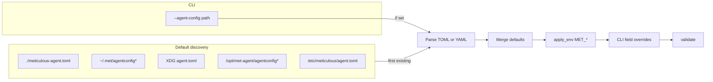

# Agent startup config file (TOML/YAML, defaults, `--agent-config`)

## Current state

- `[crates/met-agent/src/main.rs](crates/met-agent/src/main.rs)`: CLI uses `-c` / `--config` with env `MET_CONFIG`, then calls `AgentConfig::load(...)`.
- `[crates/met-agent/src/config.rs](crates/met-agent/src/config.rs)`: Loads **TOML only** via `toml::from_str`. Default search order is `/etc/meticulous/agent.toml`, `ProjectDirs::from("dev", "meticulous", "agent").config_dir()/agent.toml`, then `./meticulous-agent.toml`.
- Workspace already has `[serde_yaml](Cargo.toml)` (workspace dependency); `met-agent` only needs it added to `[crates/met-agent/Cargo.toml](crates/met-agent/Cargo.toml)`.

## Intended behavior

**Formats**: Same schema as today’s `AgentConfig` / `TlsConfig` (`[config.rs](crates/met-agent/src/config.rs)`) — deserialize with either `toml` or `serde_yaml` depending on path extension or content sniffing for extensionless paths like `agentconfig`.

**Explicit path**: Add long flag `--agent-config <PATH>` (and short flag only if you want one; you did not require `-c`). Recommended env: `MET_AGENT_CONFIG`. Keep `MET_CONFIG` (and optionally `--config`) as **deprecated aliases** parsed by clap so existing deployments do not break.

**Default locations** (first existing file wins — list ordered from most local/overridable to more global; adjust if you prefer strict POSIX “user before system” only):

1. `./meticulous-agent.toml` (keep — convenient for dev; could later add `./agentconfig` probe if desired)
2. `~/.met/agentconfig` — resolve with `[home](https://crates.io/crates/home)` or `dirs::home_dir()` (add tiny dep or use `directories` if already sufficient); try extensionless path, then `.toml`, then `.yaml`/`.yml` if the bare path is missing
3. XDG-style path from `ProjectDirs::from("dev", "meticulous", "agent")` → `agent.toml` (backward compatible)
4. `/opt/met-agent/agentconfig` (+ same extension fallbacks as above)
5. `/etc/meticulous/agent.toml` (backward compatible)

**Note on the path you wrote** (`~/home/.met/...`): Standard user location is `**$HOME/.met/agentconfig`**, not `~/home/.met`. The plan uses `$HOME/.met/agentconfig` unless you specify otherwise.

**Precedence** (unchanged from documented `load` contract): after merging file → `apply_env()` → CLI-injected overrides from `main`, CLI/env still wins for fields that are passed as overrides (controller URL, join token, name, pool, tags). Ensure any *new* CLI flags for settings that should override the file follow the same pattern.

**Parsing helper** (new private function in `config.rs`, roughly):

- If extension is `.yaml` or `.yml` → `serde_yaml::from_str`
- If `.toml` → `toml::from_str`
- If extension missing / unknown → try TOML first, on parse error try YAML (or the inverse — pick one order and document; TOML-first matches current default bias)

Map clear errors into `AgentError::Config` with the file path in the message.

**Logging**: Keep `info!(path = %path.display(), "loading config file")` when a file is actually read.

**Tests**: Add unit tests in `met-agent` with `tempfile`: write minimal TOML and YAML fixtures, assert `load(Some(path), ...)` merges and validates; test default discovery order by creating files in temp dirs and setting env or using a test-only hook if directory scanning needs it (prefer passing `config_path: Some` in tests; optionally add `#[cfg(test)]` search path injection only if needed).

**Docs / examples**: Optional one-line in crate doc or `--help` text listing default search paths (no new markdown file unless you ask).

## Files to touch

| File                                                               | Change                                                                                                                                   |
| ------------------------------------------------------------------ | ---------------------------------------------------------------------------------------------------------------------------------------- |
| `[crates/met-agent/Cargo.toml](crates/met-agent/Cargo.toml)`       | Add `serde_yaml = { workspace = true }`; optionally `home` if not using existing crates for `$HOME`                                      |
| `[crates/met-agent/src/main.rs](crates/met-agent/src/main.rs)`     | Replace/augment `--config` with `--agent-config`, env `MET_AGENT_CONFIG`, aliases for old names                                          |
| `[crates/met-agent/src/config.rs](crates/met-agent/src/config.rs)` | `default_config_path()` expanded list + `parse_config_file(&Path)` for TOML/YAML; consider small refactor so extension probing stays DRY |

## Security (workspace rules)

- No secrets hardcoded in repo; join tokens in a user-owned config file are acceptable (same trust model as `MET_JOIN_TOKEN`). Do not log file contents at info level.

