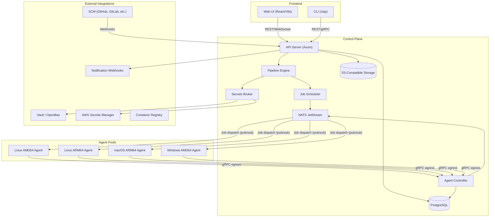

# Meticulous -- Master Architecture Plan

## Vision Recap

A security-first CI/CD and release platform that provides end-to-end visibility from `git push` to production release. Kubernetes-native, reusable-workflows-by-design, with a focus on supply chain security (SBOM, attestation, blast radius tracking).

## Tech Stack

- **Language**: Rust (all core components -- agent, controller, API server, pipeline engine, CLI)
- **Async Runtime**: Tokio
- **Web Framework**: Axum (API server)
- **Database**: PostgreSQL (via `sqlx` for compile-time checked queries)
- **Message Broker**: NATS with JetStream -- ideal for the pub/sub agent model (agents only need egress, supports persistent queues, lightweight)
- **gRPC**: `tonic` for agent-to-controller communication (registration, heartbeat, job status)
- **Kubernetes**: `kube-rs` for the operator/controller
- **CLI**: `clap`
- **Frontend**: SvelteKit + TypeScript (Svelte 5), with WebSocket-based log streaming
- **Object Storage**: S3-compatible (SeaweedFS for self-hosted, or AWS S3/GCS)
- **Metrics**: OpenTelemetry SDK -> Prometheus-compatible TSDB
- **Serialization**: serde + serde_yaml / serde_json

## System Architecture




## Core Hierarchy

```
Organization/Tenant
  └── Project (owner: user or group)
        ├── Pipelines (defined in .stable/*.yaml or code)
        │     ├── Jobs (units of execution, form a DAG)
        │     │     └── Steps (individual commands/actions)
        │     ├── Secrets (scoped: project or global)
        │     ├── Variables (scoped: project or global)
        │     └── Triggers (webhook, manual, tag, schedule)
        └── Reusable Workflows (project-scoped or global)
```

Reusable workflows exist at **two levels**: `global/` (platform-wide, managed by admins) and `project/` (project-scoped, managed by project owners). The pipeline YAML references them as `workflow: global/docker-build` or `workflow: project/my-custom-step`.

## Key Design Decisions

1. **Pub/Sub for job dispatch**: Agents subscribe to NATS subjects scoped by their pool tags. No inbound network access required for agents -- they initiate all connections (egress only).
2. **Per-job PKI for secrets**: Each job gets a one-time X509 keypair. The server encrypts secrets with the agent's public key. Secrets never traverse the network in plaintext and are scoped to a single job execution.
3. **Custom execution engine**: No Tekton dependency. The engine manages DAG resolution, step orchestration, caching, and artifact passing. Agents execute steps in containers (or natively on non-Linux platforms).
4. **Reusable workflows as the unit of composition**: Pipelines compose versioned reusable workflows. This enforces consistency and limits one-off configurations.
5. **External secrets preferred**: Built-in secret storage is supported but actively discouraged via UX. First-class integrations with Vault/OpenBao, AWS Secrets Manager, and Kubernetes secrets.

## Rust Workspace Structure (Proposed)

```
meticulous/
├── Cargo.toml              # Workspace root
├── crates/
│   ├── met-core/           # Shared types, error handling, config
│   ├── met-api/            # Axum API server
│   ├── met-engine/         # Pipeline engine (DAG, scheduler, execution)
│   ├── met-agent/          # Agent binary
│   ├── met-controller/     # Agent controller (registration, health, dispatch)
│   ├── met-secrets/        # Secrets broker (PKI, external provider integrations)
│   ├── met-parser/         # Pipeline definition parsers (YAML, TS, Python)
│   ├── met-cli/            # Developer CLI
│   ├── met-operator/       # Kubernetes operator (kube-rs)
│   ├── met-store/          # Database layer (sqlx, migrations)
│   ├── met-objstore/       # Object storage abstraction (S3/SeaweedFS)
│   ├── met-logging/        # Log shipping, streaming, aggregation
│   └── met-telemetry/      # OpenTelemetry metrics and tracing
├── frontend/               # React/Vite SPA
├── proto/                  # Protobuf definitions for gRPC
├── migrations/             # SQL migrations
├── design/                 # Design documents (existing notes)
└── deploy/                 # Helm charts, K8s manifests, Docker
```

## Phased Build Order


| Phase | Focus                  | Key Deliverables                                                                                          |
| ----- | ---------------------- | --------------------------------------------------------------------------------------------------------- |
| 0     | **Foundation**         | Workspace scaffolding, `met-core` types, Postgres schema, protobuf definitions, CI for the project itself |
| 1     | **Agent System**       | `met-agent` binary, `met-controller`, NATS integration, agent provisioning flow, join tokens              |
| 2     | **Pipeline Engine**    | YAML parser, DAG resolution, job scheduling, step execution in containers, variable/secret injection      |
| 3     | **Security Layer**     | Per-job PKI, OIDC/JWT, secrets broker integrations (Vault, AWS SM), syscall/binary auditing               |
| 4     | **API & CLI**          | REST API (CRUD for projects/pipelines/runs), WebSocket log streaming, `met-cli` for local dev             |
| 5     | **Frontend**           | Web UI -- project dashboard, pipeline runs, live logs, DAG viewer, user/group management                  |
| 6     | **Observability**      | OTel metrics, log shipping/aggregation, SBOM generation/diff, blast radius tracking, tool database        |
| 7     | **Release Management** | Release workflows, scheduling, rollback, comms generator, notification integrations                       |


## Sub-Plans (to be created)

Each of these will be a dedicated plan with detailed design, crate-level tasks, and implementation specifics:

1. **Foundation and Scaffolding** -- Workspace setup, `met-core`, Postgres schema, protobuf, CI bootstrap
2. **Agent System** -- Agent binary, controller, pub/sub, provisioning, multi-platform, K8s operator
3. **Pipeline Engine** -- Parsers, DAG execution, reusable workflows, caching, variable/secret injection
4. **Security and Secrets** -- PKI, OIDC, secrets broker, external integrations, syscall auditing, blast radius
5. **API and CLI** -- REST endpoints, WebSocket streaming, auth, CLI UX, debug mode
6. **Frontend and UI** -- React app architecture, pages, log viewer, DAG visualization, SBOM viewer
7. **Observability and Storage** -- Metrics, log pipeline, object storage, SBOM/attestation, tool tracking

