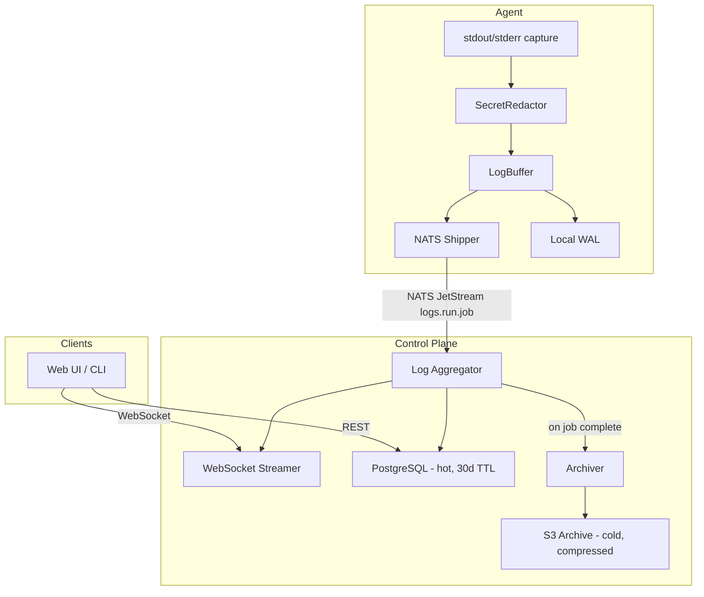

# Meticulous -- Observability and Storage Plan

**Phase 6** | Depends on: Phase 0 (Foundation), Phase 1 (Agent System), Phase 2 (Pipeline Engine), Phase 4 (API & CLI)

Parent: [Master Architecture](master_architecture_4bf1d365.plan.md)

---

## 1. Overview

This plan covers the full observability and storage stack: OpenTelemetry metrics/tracing, log shipping and streaming, S3-compatible object storage, SBOM generation/diffing, binary/tool tracking, and blast radius analysis. The goal is end-to-end visibility from `git push` to production release -- every metric, log line, artifact, tool binary, and supply-chain attestation captured, queryable, and diffable.

Three Rust crates own this domain:

- `**met-telemetry`** -- OpenTelemetry SDK integration (metrics, traces, span context propagation)
- `**met-logging`** -- Log capture on agents, shipping to the control plane, streaming to frontend, long-term storage
- `**met-objstore`** -- S3-compatible object storage abstraction (artifacts, SBOMs, attestations, log archives)

Additional logic (SBOM diffing, tool database, blast radius) lives partly in `met-engine` and `met-api` but depends heavily on the storage and telemetry crates.

---

## 2. OpenTelemetry Metrics and Tracing (`met-telemetry`)

### 2.1 Design Goals

- Single instrumentation layer used by every Rust binary (API server, controller, engine, agent, CLI).
- Export to any Prometheus-compatible TSDB and any OTLP-compatible trace backend.
- Propagate trace context across process boundaries: HTTP headers, gRPC metadata, NATS message headers.
- Zero-allocation fast path for disabled metrics/spans (compile-time feature gates).

### 2.2 Crate Structure

```
crates/met-telemetry/
  src/
    lib.rs            # Public API: init_telemetry(), shutdown()
    config.rs         # TelemetryConfig (from met-core config)
    metrics.rs        # Metric instruments (counters, histograms, gauges)
    tracing.rs        # Span creation, context propagation helpers
    propagation.rs    # Inject/extract for HTTP, gRPC, NATS headers
    middleware.rs      # Axum layer, tonic interceptor for auto-instrumentation
    exporters.rs      # OTLP gRPC/HTTP exporter, Prometheus scrape endpoint
```

### 2.3 Configuration

```yaml
telemetry:
  enabled: true
  service_name: "met-api"
  otlp_endpoint: "http://otel-collector:4317"
  otlp_protocol: grpc           # grpc | http
  metrics:
    export_interval_secs: 15
    prometheus_scrape:
      enabled: true
      bind: "0.0.0.0:9090"
      path: "/metrics"
  tracing:
    sample_rate: 1.0             # 0.0-1.0, or "always_on" / "always_off"
    propagation: ["tracecontext", "baggage"]
  resource_attributes:
    environment: "production"
    cluster: "us-east-1"
```

### 2.4 Key Metrics

Platform-wide metrics emitted from various crates, all prefixed `met_`:

- **Engine**: `met_pipeline_runs_total` (counter, by project/pipeline/status), `met_pipeline_duration_seconds` (histogram), `met_job_duration_seconds` (histogram, by project/pipeline/job/agent_pool), `met_sbom_components_total` (gauge), `met_tool_unique_binaries` (gauge)
- **Agent**: `met_step_duration_seconds` (histogram, by project/pipeline/job/step), `met_log_lines_shipped_total` (counter, by agent_id/job_id), `met_artifact_upload_bytes` (counter), `met_artifact_upload_duration_seconds` (histogram)
- **Controller/NATS**: `met_job_queue_depth` (gauge, by pool/subject), `met_agent_connected` (gauge, by pool/arch/os), `met_agent_heartbeat_lag_seconds` (histogram)
- **Secrets Broker**: `met_secret_fetch_duration_seconds` (histogram, by provider), `met_secret_fetch_errors_total` (counter, by provider/error_type)
- **API Server**: `met_api_request_duration_seconds` (histogram, by method/path/status), `met_api_requests_total` (counter)
- **ObjStore**: `met_objstore_operations_total` (counter, by operation/bucket)
- **All**: `met_nats_publish_errors_total` (counter, by subject)

### 2.5 Distributed Tracing

Trace context propagation across process boundaries:

```
API Request (span: api.handle_trigger)
  -> Engine (span: engine.evaluate_pipeline)
    -> Scheduler (span: scheduler.dispatch_job)
      -> NATS publish (inject traceparent into NATS headers)
        -> Agent (span: agent.execute_job, extract traceparent)
          -> Step 1 (span: agent.step.clone)
          -> Step 2 (span: agent.step.build)
          -> Step 3 (span: agent.step.push)
            -> gRPC callback (span: controller.report_status)
```

**Implementation approach:**

- Use `opentelemetry` + `opentelemetry-otlp` + `opentelemetry-prometheus` crates.
- Use `tracing` crate as the facade with `tracing-opentelemetry` bridge.
- Axum: `tower-http` `TraceLayer` + custom `MakeSpan` that extracts incoming trace context.
- Tonic: `tonic` interceptor for inject/extract.
- NATS: custom `propagation::inject_nats()` / `propagation::extract_nats()` that read/write `traceparent` and `tracestate` from NATS message headers.

### 2.6 Rust Dependencies

```toml
[dependencies]
opentelemetry = { version = "0.28", features = ["metrics", "trace"] }
opentelemetry_sdk = { version = "0.28", features = ["rt-tokio"] }
opentelemetry-otlp = { version = "0.28", features = ["grpc-tonic", "http-proto", "metrics", "trace"] }
opentelemetry-prometheus = "0.28"
prometheus = "0.13"
tracing = "0.1"
tracing-subscriber = { version = "0.3", features = ["env-filter", "json"] }
tracing-opentelemetry = "0.28"
```

*(Pin to latest compatible versions at implementation time.)*

---

## 3. Log Shipping, Streaming, and Aggregation (`met-logging`)

### 3.1 Design Goals

- Capture stdout/stderr from every step of every job.
- Stream logs to the control plane in real-time (for live viewing in browser/CLI).
- Redact secrets before logs leave the agent (hash pattern matching + known secret values).
- Store logs durably for post-hoc viewing and audit.
- Support structured log metadata: `run_id`, `job_id`, `step_index`, `timestamp`, `stream` (stdout/stderr).
- Handle high-throughput bursts without backpressure killing the pipeline.

### 3.2 Architecture




### 3.3 Crate Structure

```
crates/met-logging/
  src/
    lib.rs             # Public API
    capture.rs         # Stdout/stderr capture from child processes
    redactor.rs        # Secret redaction engine (plaintext + base64 patterns)
    buffer.rs          # Ring buffer with backpressure and overflow policy
    shipper.rs         # Ships log chunks to NATS JetStream
    wal.rs             # Write-ahead log for agent-side durability
    aggregator.rs      # Control-plane side: consumes NATS, fans out
    streamer.rs        # WebSocket fan-out for live log viewing
    archiver.rs        # Compresses and ships to S3 on job completion
    models.rs          # LogLine, LogChunk, LogMetadata types
    retention.rs       # TTL-based cleanup from Postgres, lifecycle rules for S3
```

### 3.4 Log Data Model

```rust
pub struct LogLine {
    pub run_id: Uuid,
    pub job_id: Uuid,
    pub step_index: u32,
    pub line_number: u64,
    pub timestamp: DateTime<Utc>,
    pub stream: LogStream,     // Stdout | Stderr
    pub content: String,       // After redaction
}

pub enum LogStream { Stdout, Stderr }

pub struct LogChunk {
    pub run_id: Uuid,
    pub job_id: Uuid,
    pub step_index: u32,
    pub lines: Vec<LogLine>,
    pub sequence: u64,         // Monotonic per-job, for ordering
    pub hmac: Vec<u8>,         // HMAC-SHA256 integrity digest
}
```

### 3.5 Secret Redaction

Secrets must be scrubbed before log data leaves the agent process (ref: [design/notes/pipelines.md](../../design/notes/pipelines.md) -- "Secret fields MUST ALWAYS be hashed when printing to stdout or logs", including base64-encoded forms).

**Redaction strategy:**

1. Before a job starts, the agent receives the decrypted secret values.
2. Build a `RedactionSet`: for each secret value, generate match patterns for raw plaintext, base64-encoded form, URL-encoded form, and common shell-escaped forms.
3. Apply Aho-Corasick multi-pattern matching on every log line, replacing matches with `*`**.
4. The `RedactionSet` is held in memory only for the duration of the job and zeroed on completion.

```rust
pub struct SecretRedactor {
    matcher: AhoCorasick,
    replacement: &'static str, // "***"
}

impl SecretRedactor {
    pub fn new(secret_values: &[SecretString]) -> Self { /* ... */ }
    pub fn redact(&self, line: &str) -> String { /* ... */ }
}
```

**Dependency:** `aho-corasick` crate for efficient multi-pattern matching.

### 3.6 Agent-Side Log Shipping

1. Step stdout/stderr is captured via `tokio::process::Command` with piped outputs.
2. Each line passes through the `SecretRedactor`.
3. Redacted lines are pushed into a bounded ring buffer (`buffer.rs`).
4. The shipper drains the buffer in chunks (configurable batch size, default 100 lines or 50ms debounce) and publishes to NATS JetStream subject `logs.{run_id}.{job_id}`.
5. If NATS is unreachable, lines spill to a local write-ahead log (WAL) on the agent's ephemeral disk. The WAL is replayed when connectivity resumes.
6. Backpressure policy: if the buffer is full, the oldest unshipped lines are dropped and a `[met: N log lines dropped due to backpressure]` marker is inserted.

### 3.7 Control-Plane Log Aggregator

Runs as a component inside the API server process (or as a standalone sidecar, configurable):

1. Subscribe to NATS JetStream `logs.>` (wildcard for all runs).
2. For each `LogChunk`: verify HMAC-SHA256 integrity, insert into PostgreSQL `run_logs` table (indexed by `run_id`, `job_id`, `step_index`, `line_number`), fan out to any active WebSocket subscribers for that `run_id`.
3. On job completion event, trigger the archiver.

### 3.8 WebSocket Log Streaming

The API server exposes `GET /ws/runs/{run_id}/logs?job_id=&step_index=` for live log streaming.

- Client connects, optionally sends a `since_line` to resume from a specific line number.
- Server replays buffered lines from PostgreSQL, then switches to live NATS-fed streaming.
- Messages are JSON: `{ "job_id": "...", "step_index": 0, "lines": [...] }`.
- Heartbeat pings every 15 seconds to detect stale connections.

### 3.9 Log Archival and Retention

- **Hot tier**: PostgreSQL `run_logs` table, 30 days (configurable), rows per line.
- **Cold tier**: S3-compatible object storage, indefinite (lifecycle policy), gzip-compressed JSONL per job.
- On job completion, the archiver compresses all log lines for the job into a single `.jsonl.gz` file and uploads to S3 at `logs/{project_id}/{run_id}/{job_id}.jsonl.gz`.
- A background task runs daily to purge PostgreSQL rows older than the hot retention window.
- S3 lifecycle policies are documented but managed externally (Terraform/Helm values).

### 3.10 Write-Once Log Integrity

To address the concern of bad actors deleting or modifying logs (ref: [design/notes/open-questions.md](../../design/notes/open-questions.md)):

- **PostgreSQL**: the `run_logs` table uses row-level security. Only the aggregator service role can INSERT. No UPDATE or DELETE is granted to application roles until the retention sweeper runs (which operates under a separate, audited role).
- **S3**: recommend enabling Object Lock (WORM) on the logs bucket with a governance-mode retention period. Document this in the deployment guide.
- **Integrity**: Each `LogChunk` shipped from the agent includes an HMAC-SHA256 digest (keyed with the job's ephemeral PKI key) so the control plane can verify integrity on receipt.

---

## 4. Object Storage Abstraction (`met-objstore`)

### 4.1 Design Goals

- Unified trait-based abstraction over S3-compatible backends (AWS S3, GCS, SeaweedFS, etc.).
- Used for: build artifacts, cached layers, log archives, SBOMs, attestations, tool binaries.
- Multipart upload support for large artifacts.
- Streaming downloads (no full-file buffering in memory).
- Presigned URL generation for direct browser downloads.

### 4.2 Crate Structure

```
crates/met-objstore/
  src/
    lib.rs           # Public API, re-exports
    config.rs        # ObjectStoreConfig
    traits.rs        # ObjectStore trait definition
    s3.rs            # S3-compatible implementation (aws-sdk-s3)
    paths.rs         # Bucket/key path conventions
    multipart.rs     # Multipart upload/download helpers
    presigned.rs     # Presigned URL generation
    error.rs         # ObjectStoreError types
```

### 4.3 Trait Design

```rust
#[async_trait]
pub trait ObjectStore: Send + Sync {
    async fn put_object(&self, key: &ObjectKey, body: ByteStream) -> Result<PutResult>;
    async fn get_object(&self, key: &ObjectKey) -> Result<GetResult>;
    async fn head_object(&self, key: &ObjectKey) -> Result<ObjectMeta>;
    async fn delete_object(&self, key: &ObjectKey) -> Result<()>;
    async fn list_objects(&self, prefix: &str) -> Result<Vec<ObjectMeta>>;
    async fn presigned_get(&self, key: &ObjectKey, expires_in: Duration) -> Result<Url>;
    async fn presigned_put(&self, key: &ObjectKey, expires_in: Duration) -> Result<Url>;
    async fn initiate_multipart(&self, key: &ObjectKey) -> Result<MultipartUpload>;
}
```

### 4.4 Bucket and Key Conventions

```
met-artifacts/{project_id}/{pipeline_id}/{run_id}/
  artifacts/{artifact_name}
  cache/{cache_key}.tar.zst

met-logs/{project_id}/{run_id}/{job_id}.jsonl.gz

met-sboms/{project_id}/{pipeline_id}/{run_id}/{job_id}/{step_index}.spdx.json
                                                       {step_index}.cdx.json

met-attestations/{project_id}/{pipeline_id}/{run_id}/{job_id}.intoto.jsonl

met-tools/binaries/{sha256}/{binary_name}
```

### 4.5 Configuration

```yaml
objstore:
  backend: s3
  s3:
    endpoint: "https://s3.us-east-1.amazonaws.com"
    region: "us-east-1"
    access_key_id: "${AWS_ACCESS_KEY_ID}"
    secret_access_key: "${AWS_SECRET_ACCESS_KEY}"
    force_path_style: false    # true for SeaweedFS
  buckets:
    artifacts: "met-artifacts"
    logs: "met-logs"
    sboms: "met-sboms"
    attestations: "met-attestations"
    tools: "met-tools"
  upload:
    multipart_threshold_bytes: 8388608   # 8MB
    multipart_chunk_bytes: 8388608
    max_concurrent_uploads: 4
```

---

## 5. SBOM Generation, Storage, and Diffing

### 5.1 Design Goals

- Automatically generate SBOMs for container image builds (SPDX and/or CycloneDX).
- Store SBOMs alongside their run in object storage.
- Index SBOM component metadata in PostgreSQL for fast querying.
- Provide a diff view: compare SBOM from run N vs. run N-1 (new deps, removed deps, version changes).
- Expose via API for frontend SBOM viewer and CLI queries (ref: [design/notes/user-interface.md](../../design/notes/user-interface.md) -- "SBOM change/diff viewer").

### 5.2 SBOM Generation

Container builds using `docker buildx` with `--sbom=true` natively produce SPDX SBOMs via BuildKit. For non-container builds, optionally invoke `syft` or `trivy` via a reusable workflow step.

**Agent-side flow:**

1. After a container build step completes, extract the SBOM from the build attestation (`docker buildx imagetools inspect --format '{{json .SBOM}}'`).
2. Parse the SBOM into the internal `SbomReport` model.
3. Upload raw SBOM JSON to S3 (`met-sboms/{project}/{pipeline}/{run}/{job}/{step}.spdx.json`).
4. Ship the parsed component list to the control plane via gRPC (`ReportSbom` RPC).

### 5.3 Data Model

```sql
CREATE TABLE sbom_reports (
    id              UUID PRIMARY KEY DEFAULT gen_random_uuid(),
    run_id          UUID NOT NULL REFERENCES pipeline_runs(id),
    job_id          UUID NOT NULL,
    step_index      INT NOT NULL,
    format          TEXT NOT NULL,         -- 'spdx' | 'cyclonedx'
    s3_key          TEXT NOT NULL,
    component_count INT NOT NULL,
    created_at      TIMESTAMPTZ NOT NULL DEFAULT now(),
    UNIQUE(run_id, job_id, step_index, format)
);

CREATE TABLE sbom_components (
    id              UUID PRIMARY KEY DEFAULT gen_random_uuid(),
    report_id       UUID NOT NULL REFERENCES sbom_reports(id) ON DELETE CASCADE,
    name            TEXT NOT NULL,
    version         TEXT,
    purl            TEXT,                  -- Package URL (pkg:npm/lodash@4.17.21)
    cpe             TEXT,
    license         TEXT,
    supplier        TEXT,
    sha256          TEXT
);

CREATE INDEX idx_sbom_components_purl ON sbom_components(purl);
CREATE INDEX idx_sbom_components_name_version ON sbom_components(name, version);
CREATE INDEX idx_sbom_reports_run ON sbom_reports(run_id);
```

### 5.4 SBOM Diffing

The diff engine compares two `sbom_reports` (typically consecutive runs of the same pipeline):

```rust
pub struct SbomDiff {
    pub base_report_id: Uuid,
    pub head_report_id: Uuid,
    pub added: Vec<SbomComponent>,
    pub removed: Vec<SbomComponent>,
    pub changed: Vec<SbomVersionChange>,
    pub unchanged_count: usize,
}

pub struct SbomVersionChange {
    pub name: String,
    pub purl: Option<String>,
    pub old_version: Option<String>,
    pub new_version: Option<String>,
}
```

Components are matched by `purl` (preferred) or `(name, version)` tuple. The diff is computed in-memory from indexed `sbom_components` rows.

### 5.5 API Endpoints

- `GET /api/v1/runs/{run_id}/sboms` -- List SBOM reports for a run
- `GET /api/v1/sboms/{report_id}` -- Get SBOM report metadata
- `GET /api/v1/sboms/{report_id}/components` -- List components (paginated, filterable)
- `GET /api/v1/sboms/{report_id}/download` -- Presigned URL to raw SBOM file
- `GET /api/v1/sboms/diff?base={id}&head={id}` -- Compute and return SBOM diff
- `GET /api/v1/projects/{project_id}/sbom-history` -- SBOM component count trend over runs

---

## 6. Tool Database and Binary Tracking

### 6.1 Design Goals

- Record every binary executed during a pipeline run, along with its SHA-256 hash, version (if detectable), and path (ref: [design/notes/security.md](../../design/notes/security.md) -- "Watch syscalls and get all binaries and sha256sum", "Tool versioned/SHA256sum per-run").
- Build a platform-wide "tool database" that tracks which tool versions are in use across all projects.
- Enable "blast radius" queries: given a compromised binary SHA, determine which projects, pipelines, and runs used it (ref: [design/notes/security.md](../../design/notes/security.md) -- "Blast Radius Identification").
- Support the UI's tool search and trend views (ref: [design/notes/user-interface.md](../../design/notes/user-interface.md) -- "tool search" and "tool database and tracking to generate blast radius").

### 6.2 Agent-Side Binary Capture

Two collection methods:

**Method A -- Explicit tool tracking (recommended, lower overhead):**
Each reusable workflow declares the tools it uses. The agent resolves the binary path and computes SHA-256 before execution.

```yaml
# In a reusable workflow definition
tools:
  - name: docker
    expected_path: /usr/bin/docker
  - name: syft
    expected_path: /usr/local/bin/syft
```

**Method B -- Syscall-based collection (opt-in, Linux only):**
eBPF (`execsnoop`-style) or `strace`-based monitoring to capture all `execve` syscalls during the job. More comprehensive but requires privileged containers or specific kernel capabilities. Default to Method A; Method B is opt-in.

### 6.3 Pre-Populated Build Tool Volumes

(Ref: [design/notes/random-thoughts.md](../../design/notes/random-thoughts.md) -- "Pre-populate build tool volumes, mount as read-only for agents")

```
/buildtools/{binary_name}/{version}/{arch}/{binary_name}
```

- Latest version of each tool symlinked to `/usr/local/bin/{binary_name}`.
- Tool volumes mounted read-only into agent containers (OCI image pulled as init container, extracted to emptyDir, then mounted read-only).
- Tool volume manifest is versioned and its SHA-256 recorded, providing a deterministic baseline.
- Updates to the tool volume are a platform operation (new OCI image tag), not a per-pipeline concern.

### 6.4 Data Model

```sql
CREATE TABLE tool_binaries (
    id              UUID PRIMARY KEY DEFAULT gen_random_uuid(),
    name            TEXT NOT NULL,
    version         TEXT,
    sha256          TEXT NOT NULL,
    path            TEXT NOT NULL,
    arch            TEXT NOT NULL,
    os              TEXT NOT NULL,
    first_seen_at   TIMESTAMPTZ NOT NULL DEFAULT now(),
    UNIQUE(sha256)
);

CREATE TABLE run_tools (
    id              UUID PRIMARY KEY DEFAULT gen_random_uuid(),
    run_id          UUID NOT NULL REFERENCES pipeline_runs(id),
    job_id          UUID NOT NULL,
    tool_binary_id  UUID NOT NULL REFERENCES tool_binaries(id),
    invocation_count INT NOT NULL DEFAULT 1,
    UNIQUE(run_id, job_id, tool_binary_id)
);

CREATE INDEX idx_tool_binaries_name ON tool_binaries(name);
CREATE INDEX idx_tool_binaries_sha ON tool_binaries(sha256);
CREATE INDEX idx_run_tools_run ON run_tools(run_id);
CREATE INDEX idx_run_tools_tool ON run_tools(tool_binary_id);
```

### 6.5 Blast Radius Analysis

Given a compromised SHA-256 hash:

```sql
SELECT DISTINCT
    pr.project_id, pr.pipeline_id, pr.id AS run_id, pr.created_at,
    tb.name AS tool_name, tb.version AS tool_version
FROM run_tools rt
JOIN tool_binaries tb ON rt.tool_binary_id = tb.id
JOIN pipeline_runs pr ON rt.run_id = pr.id
WHERE tb.sha256 = $1
ORDER BY pr.created_at DESC;
```

API: `GET /api/v1/tools/blast-radius?sha256={hash}` returns affected runs/projects/pipelines count +