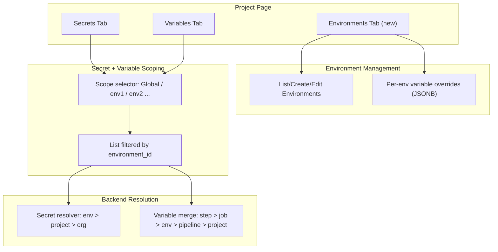
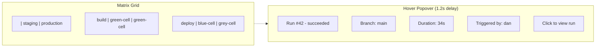

# Pipeline Environments UX Plan

## Current State

The DB schema is mostly in place: `environments` table (migration 046), `builtin_secrets.environment_id` column (migration 047), environment CRUD API routes, and frontend types/client. However the **application layer doesn't use `environment_id` yet** — the secret resolution repo, stored-secrets API, and variable API all ignore it. There is no UI for managing environments or scoping secrets/variables to them.

## Architecture



## Changes by Layer

### 1. Backend: Store Layer (`crates/met-store/src/repos/`)

**`builtin_secrets.rs`** — Add `environment_id` throughout:
- Add `environment_id: Option<Uuid>` to `BuiltinSecretMetaRow`
- Update `insert_encrypted` to accept `environment_id: Option<Uuid>`
- Update `get_current_cipher_row_impl` to filter by `environment_id` when provided
- Add `list_for_environment(org_id, project_id, environment_id)` — returns env-scoped + project-scoped secrets
- Update `next_version` and `list_versions_for_scope` to include `environment_id`
- Update `exists_resolvable` to accept optional `environment_id`

**`environments.rs`** — Fix approval routes:
- `record_approval` currently receives `Uuid::nil()` — the API route must resolve `env_name` to a real `environment_id` via `get_by_name`

### 2. Backend: Secret Resolution (`crates/met-secret-resolve/src/resolve.rs`)

- Thread `environment_id: Option<Uuid>` through `validate_secret_refs` and `resolve_stored_secret_map`
- Resolution order: environment-scoped (matching `environment_id`) then project-scoped (`environment_id IS NULL`) then org-scoped — first match wins (per ADR-016)

### 3. Backend: API Routes

**`stored_secrets.rs`**:
- Add optional `environment_id` to `CreateStoredSecretRequest` and `StoredSecretResponse`
- Add optional `environment_id` query param to list endpoints
- Thread into `insert_encrypted` / `list_for_environment`

**`variables.rs`**:
- Add optional `environment_id` to the `variables` table (new migration 049)
- Add `environment_id` to `CreateVariableRequest`, `VariableRow`, list filters
- When listing, support `?environment_id=<uuid>` to show env-scoped + global

**`environments.rs`**:
- Fix `approve_deployment` / `reject_deployment` to resolve `env_name` → `environment_id` from the run's project

### 4. Database Migration

New migration `049_variables_environment_scope.sql`:
```sql
ALTER TABLE variables ADD COLUMN IF NOT EXISTS environment_id UUID REFERENCES environments(id);
```
This keeps the relational `variables` table as the single source of truth (instead of the JSONB `environments.variables` field, which becomes a lightweight override or is deprecated in favor of the table approach).

### 5. Frontend: New "Environments" Tab on Project Page

Add `environments` as a new top-level tab (between Secrets and Settings):
- **List view**: cards for each environment showing name, tier badge, approval config summary
- **Create dialog**: name (slug), display name, tier selector (development/staging/production/custom)
- **Detail/edit**: inline form for display name, tier, description, approval settings (toggle + count + timeout), allowed branches (tag-style input), auto-deploy branch

### 6. Frontend: Environment Scope Selector on Secrets + Variables

On both the Secrets and Variables tabs, add a scope filter bar at the top:
- Pill-style selector: **Global** (default, `environment_id IS NULL`) plus one pill per environment in the project
- Selecting an environment filters the list to show: env-scoped items + inherited global items (with "inherited" badge)
- The "Add secret" / "Add variable" dialog gains an **Environment** field: a searchable dropdown defaulting to "Global" that lists project environments
- When an environment is selected in the dialog, the created secret/variable gets `environment_id` set

### 7. Frontend: API Types + Client

- Add `environment_id?: string` to `StoredSecret`, `CreateStoredSecretInput` (or the equivalent body type used in `storedSecrets.create`)
- Add `environment_id?: string` to `ProjectVariable` (or `VariableRow`), `CreateVariableRequest`
- Add `environment_id` query param support to `storedSecrets.list` and `variables.list`

### 8. Engine Integration (existing, verify)

`crates/met-engine/src/executor.rs` — When dispatching a job with `environment: staging` in the YAML:
- Look up `environments` row by `(project_id, name)`
- Check `allowed_branches` (already implemented in `EnvironmentRepo::branch_allowed`)
- Pass `environment_id` to `met-secret-resolve` for scoped resolution
- Merge `environments.variables` into the variable context at the correct precedence level

This is partially wired (the parser field exists, the repo exists) but the executor doesn't call it yet. This is the last step to make environments actually affect job execution.

### 9. Database: Run + Job Run Environment Tracking

New migration `050_run_environment_tracking.sql`:
```sql
ALTER TABLE runs ADD COLUMN IF NOT EXISTS environment_id UUID REFERENCES environments(id);
ALTER TABLE job_runs ADD COLUMN IF NOT EXISTS workflow_invocation_id TEXT;
CREATE INDEX IF NOT EXISTS idx_job_runs_invocation ON job_runs(workflow_invocation_id) WHERE workflow_invocation_id IS NOT NULL;
CREATE INDEX IF NOT EXISTS idx_runs_environment ON runs(environment_id) WHERE environment_id IS NOT NULL;
```

- `runs.environment_id` — set by the engine when dispatching a run that targets a named environment (from `RawWorkflowInvocation.environment`). For pipelines without environments, remains NULL.
- `job_runs.workflow_invocation_id` — set by the scheduler when creating job_run rows; matches the `workflows[].id` from the pipeline YAML. Allows grouping jobs by their workflow invocation.

### 10. API: Matrix View Endpoint

New endpoint: `GET /api/v1/pipelines/{id}/matrix`

Returns the latest run status per (workflow_invocation, environment) cell:

```json
{
  "workflows": ["build", "deploy-staging", "deploy-prod"],
  "environments": [
    { "id": "...", "name": "staging", "tier": "staging" },
    { "id": "...", "name": "production", "tier": "production" }
  ],
  "cells": [
    {
      "workflow": "deploy-staging",
      "environment": "staging",
      "run_id": "...",
      "run_number": 42,
      "status": "succeeded",
      "started_at": "...",
      "finished_at": "...",
      "duration_ms": 34000,
      "branch": "main",
      "triggered_by": "dan"
    }
  ]
}
```

Implementation (`crates/met-api/src/routes/pipeline_matrix.rs`):
- Load pipeline's environments via `EnvironmentRepo::list_by_project`
- Load distinct `workflow_invocation_id` values from recent `job_runs` for this pipeline
- For each (invocation, environment) pair, find the latest run via a window query: `ROW_NUMBER() OVER (PARTITION BY workflow_invocation_id, environment_id ORDER BY run_number DESC)`
- Return the grid structure

For workflows without an environment (e.g. `build`), they appear in a special "global" row (environment = null).

### 11. Frontend: Matrix View Component

New component `frontend/src/lib/components/pipeline/RunMatrix.svelte`:



**Layout:**
- X-axis (columns): environments, ordered by tier (dev → staging → production → custom). Plus a "Global" column for workflow invocations without an environment.
- Y-axis (rows): workflow invocations from the pipeline YAML (`workflows[].id`)
- Each cell is a colored rectangle:
  - Green (`bg-green-500/20 border-green-500`) = succeeded
  - Red (`bg-red-500/20 border-red-500`) = failed
  - Blue (`bg-blue-500/20 border-blue-500`) = running
  - Gray (`bg-zinc-500/20 border-zinc-500`) = queued/pending
  - Amber (`bg-amber-500/20 border-amber-500`) = cancelled
  - Empty/dashed border = no run yet for this cell
- Cell content: run number + a small duration label

**Hover behavior:**
- `mouseenter` starts a 1.2 second timer
- If the mouse leaves before 1.2s, timer is cancelled (no popover)
- After 1.2s, a popover appears following the mouse position (using `mousemove` to track coordinates)
- Popover shows: run number, status badge, branch, commit SHA (short), triggered by, duration, started at
- Clicking the cell navigates to `/runs/{run_id}`
- Popover disappears on `mouseleave`

**Integration:**
- Shown as the **default view** on the pipeline Runs tab when the pipeline has environments
- A toggle allows switching between "Matrix" and "List" views
- The list view is the existing DataTable (preserved for pipelines without environments or when users prefer the flat view)
- The matrix auto-refreshes every 15 seconds when any cell is `running` or `queued`

## What This Does NOT Include

- **Environment-specific pipeline definitions** — the same pipeline YAML runs in all environments; only secrets/variables differ
- **Environment protection rules UI** (branch restrictions, approvals) — the API supports it but the environment detail form handles it. No separate "protection rules" page.
- **Promotion workflows** (auto-promote from staging to prod) — deferred. The YAML `needs:` already chains invocations.
- **Environment deletion cascade behavior** — uses existing DB `ON DELETE` + the `environment_id` FK on secrets becomes NULL (secrets revert to project scope)
