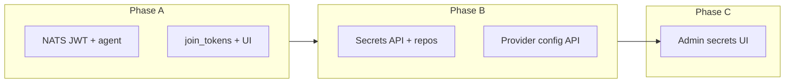

# Platform security and secrets admin — action plan

This document **merges** the previously discussed NATS / join-token / agent behavior work with **secrets management** in the admin portal and API backend. It draws on:

- [design/security.md](design/security.md) — external secret backends (AWS SM, GCP, K8s, Vault/OpenBao), multi-project stores, AppRole/JWT for Vault.
- [design/user-interface.md](design/user-interface.md) — admin-style capabilities (complementary to project views).
- [.cursor/plans/security_and_secrets_bcd5e7fa.plan.md](.cursor/plans/security_and_secrets_bcd5e7fa.plan.md) — Phase 3 security architecture (`met-secrets`, per-job PKI, providers, RBAC).
- [.cursor/plans/codebase_completion_roadmap_a65c1dae.plan.md](.cursor/plans/codebase_completion_roadmap_a65c1dae.plan.md) — API/CLI expectations for secrets.
- Current code: [crates/met-api/src/routes/secrets.rs](crates/met-api/src/routes/secrets.rs) (project-scoped CRUD, metadata-only responses), [005_security.sql](crates/met-store/migrations/005_security.sql) (`secret_provider_configs`, `builtin_secrets`).

---

## Phase A — NATS authentication and agent enrollment (prior thread)

**Goals:** Agents cannot connect to NATS without credentials issued only after successful gRPC registration; invalid join token → clear error and **exit code 1**; join tokens are one-time, described, and auditable.

| Track | Actions |
|--------|--------|
| **NATS** | Issue per-agent User JWT + NKey seed from controller (`nats-io-jwt` + env-held account signing seed); populate proto `NatsCredentials`; extend `AgentIdentity` + `async_nats::ConnectOptions`; NATS server config disables anonymous access; document `nsc`/env setup ([docker-compose](docker-compose.yml), [justfile](justfile)). |
| **Agent** | Connect to NATS only after successful register/identity load; **explicit `exit(1)`** on registration failure when token invalid; refuse empty NATS creds when auth is required. |
| **DB** | Migration: `description NOT NULL`, `consumed_by_agent_id` / `consumed_at`, `max_uses = 1` (+ backfill); controller sets consumption in register transaction. |
| **API** | `POST /admin/join-tokens`: require `description`, force `max_uses = 1`; extend `JoinTokenResponse` with description + consumption + creator. |
| **Admin UI** | Mandatory description; remove max-uses control; show creator + linked agent; fix list payload (`data` vs `items`). |

**Security rule:** No signing seeds or JWT secrets in source — only env or mounted files ([codeguard-1-hardcoded-credentials](.cursor/rules/codeguard-1-hardcoded-credentials.mdc)).

---

## Phase B — Secrets management: API backend

**Current state:** [secrets.rs](crates/met-api/src/routes/secrets.rs) implements **project-scoped** list/create/patch/delete with inline SQL. Comments say values are not returned; **`provider_key` is still written to DB** and must be treated as sensitive (encrypt at rest, avoid logging).

**Design alignment** ([design/security.md](design/security.md)):

- Prefer **external** secret stores for pipeline material; support **built-in encrypted** storage where appropriate.
- Schema already distinguishes:
  - **`secrets`** ([001_initial_schema.sql](crates/met-store/migrations/001_initial_schema.sql)) — external references (`provider`, `provider_ref` in original; verify live columns vs API).
  - **`builtin_secrets`** ([005_security.sql](crates/met-store/migrations/005_security.sql)) — encrypted value blobs + `key_id`.
  - **`secret_provider_configs`** ([005_security.sql](crates/met-store/migrations/005_security.sql)) — org/project provider wiring (JSON `config`, non-secret metadata).

**Recommended API work (incremental):**

1. **Reconcile schema vs handlers** — Ensure `met-api` `secrets` routes match actual `secrets` table columns (and migrations after 001); add `met_store::repos::SecretRepo` (or extend existing) instead of raw SQL in routes.
2. **Org-level listing (admin)** — Add routes under `/api/v1/orgs/{org_id}/secrets` or `/admin/...` consistent with [api_and_cli plan](.cursor/plans/api_and_cli_aa29f1b3.plan.md) (`org_admin` can manage org-level secret metadata). Enforce `Auth` + `require_admin` / `can_access_org` as appropriate.
3. **Secret provider configuration API** — CRUD for `secret_provider_configs` (provider type, name, JSON config). **Never** return raw credentials in responses; accept secrets via env-backed server config or one-time write endpoints that redact on read (pattern already used for OIDC client secrets in [admin.rs](crates/met-api/src/routes/admin.rs)).
4. **Built-in secret values** — If UI allows storing values in-platform, route writes through **`met-secrets`** built-in provider path to `builtin_secrets` (AES-GCM envelope per existing security plan), not plaintext columns on `secrets`.
5. **External references** — For Vault/AWS/K8s, store **references only** (`provider_ref` / path / ARN) in `secrets`; runtime resolution stays in `met-secrets` / engine (already planned in security roadmap).
6. **OpenAPI + RBAC** — Register new routes in [openapi.rs](crates/met-api/src/openapi.rs); align with RBAC ([`user.can_access_project`](crates/met-api/src/routes/secrets.rs), org admin for org resources).

**Dependencies between API pieces:** Provider configs should exist before validating “default provider” for a project; optional preflight checks can reuse `met-secrets` traits where already implemented.

---

## Phase C — Secrets management: admin portal (frontend)

**Current state:** No dedicated **pipeline/org secrets** UI under `frontend/src/routes` (only OAuth **client_secret** fields in [admin/auth](frontend/src/routes/admin/auth/+page.svelte)).

**UI work:**

1. **Navigation** — Add admin section entry (e.g. “Secrets” or under “Security”) in [Sidebar](frontend/src/lib/components/layout/Sidebar.svelte) / [admin](frontend/src/routes/admin/+page.svelte) hub, linking to `/admin/secrets` or nested `org → project` flows per IA preference.
2. **Project context** — Project-scoped secret list/create/edit/delete: mirror API (`/api/v1/projects/{id}/secrets`), show **metadata only** (name, description, scope, provider type, timestamps). **Never display** stored secret values after creation (confirm “saved” with optional one-time reveal only if product requires it — default: no reveal).
3. **Org / provider settings (admin)** — Screens for `secret_provider_configs`: list providers, enable/disable, edit non-sensitive fields; link to docs for Vault AppRole / AWS IAM / etc. per [design/security.md](design/security.md).
4. **API client** — Extend [client.ts](frontend/src/lib/api/client.ts) with `secrets` methods if not present; types in [types.ts](frontend/src/lib/api/types.ts).
5. **Consistency** — Use same patterns as other admin tables (loading, errors, pagination, `data` field from `PaginatedResponse`).

---

## Phase sequencing and dependencies

- **Phase A** can proceed in parallel with **Phase B** schema/repo work; **Phase C** depends on stable API contracts.
- If `secrets` table and API differ, **fix schema/API reconciliation first** before building UI to avoid rework.

---

## Testing and acceptance

| Area | Checks |
|------|--------|
| NATS | Anonymous connect fails; agent with issued creds succeeds. |
| Join tokens | One-time enforced; description required; consumption visible in admin. |
| Agent | Invalid token → exit code 1. |
| Secrets API | CRUD metadata; no secret values in GET; RBAC denies cross-org. |
| Admin UI | Create secret metadata; provider config saved; no accidental value leakage in network tab (only on intentional POST body). |

---

## Out of scope for this plan (follow-ups)

- Full **met-secrets** provider round-trip testing in CI for every backend (Vault/AWS/K8s) — track separately.
- **Per-job PKI** secret envelope delivery — already covered in [security_and_secrets_bcd5e7fa.plan.md](.cursor/plans/security_and_secrets_bcd5e7fa.plan.md); not duplicated here.
- **CLI** `met secret` — referenced in api_and_cli plan; optional parallel track.

---

## Todo list (execution)

Track by the YAML frontmatter IDs (all currently **pending** until implementation):

| ID | Area |
|----|------|
| `nats-jwt-issue` | Controller NATS JWT issuance |
| `nats-agent-connect` | Agent identity + NATS client auth |
| `nats-server-dev` | Dev/prod NATS server config + docs |
| `join-token-migration` | DB + model + repo for join tokens |
| `join-token-register-tx` | Controller register transaction + consumption |
| `join-token-api-ui` | Admin API + UI for join tokens |
| `agent-exit-invalid-token` | Agent exit(1) on bad registration |
| `secrets-schema-repo` | Secrets schema reconcile + repo + encryption |
| `secrets-org-routes` | Org/admin API routes + RBAC |
| `secrets-provider-config-api` | secret_provider_configs CRUD |
| `secrets-builtin-wire` | builtin_secrets via met-secrets |
| `secrets-admin-ui-nav` | Admin secrets metadata UI |
| `secrets-provider-ui` | Provider config UI + API client |
| `acceptance-tests` | End-to-end acceptance checks |
