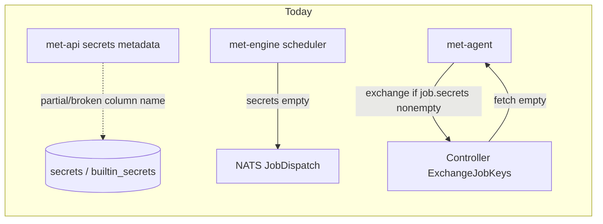
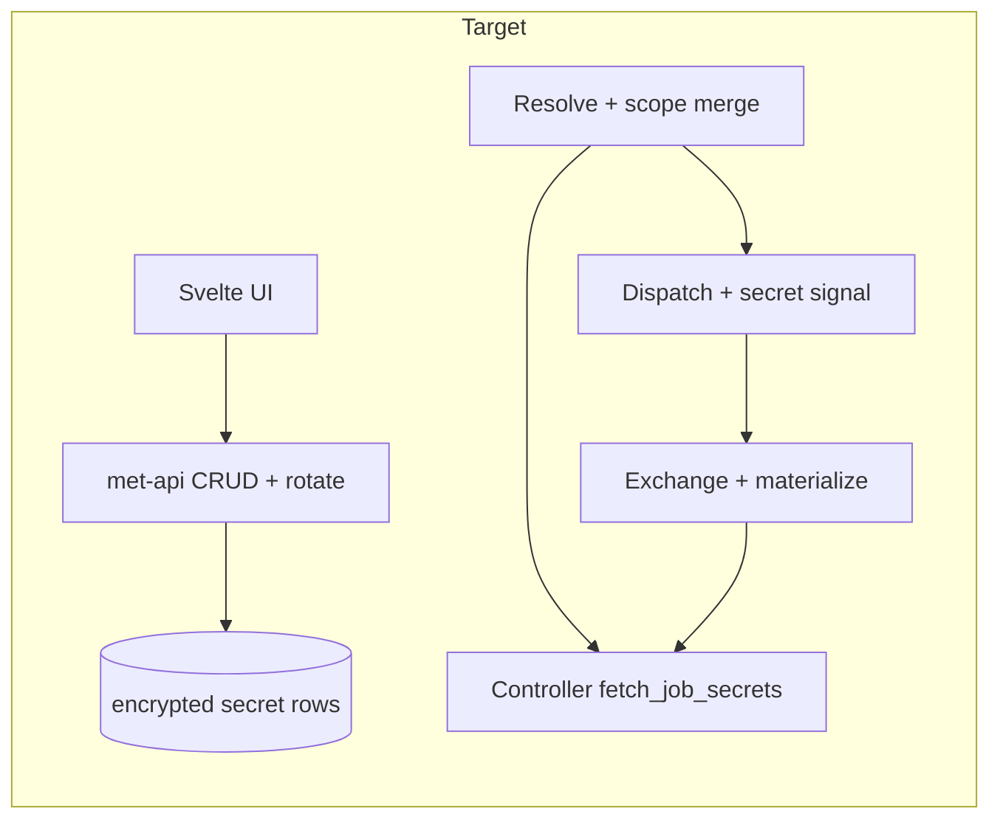

# Secrets: storage, API, UI, and agent delivery

## Current state (what already exists)

- **DB**: `[001_initial_schema.sql](crates/met-store/migrations/001_initial_schema.sql)` defines `secrets` as **metadata + external refs only** (`provider`, `provider_ref`). `[005_security.sql](crates/met-store/migrations/005_security.sql)` adds `**builtin_secrets`** (encrypted `BYTEA` + `nonce` + `key_id`, scoped `org_id` / optional `project_id`, keyed by `path` + `version`) and `secret_provider_configs`.
- **Parser**: `[met-parser](crates/met-parser/src/schema.rs)` supports pipeline `secrets:` with **AWS**, **Vault**, or **builtin** `{ name: ... }` → `[SecretRef](crates/met-parser/src/parser.rs)` in IR.
- **Engine**: `[ExecutionContext](crates/met-engine/src/context.rs)` can hold resolved secrets, but `**register_secret` is never called** from orchestration; `[Scheduler::build_dispatch_message](crates/met-engine/src/scheduler.rs)` always sends `**secrets: Vec::new()`** and `[to_proto_message](crates/met-engine/src/scheduler.rs)` duplicates that—so **no secrets reach agents** today.
- **Controller**: `[exchange_job_keys](crates/met-controller/src/grpc.rs)` implements **X25519 + AES-GCM hybrid encryption** and HMAC checksums, but `[fetch_job_secrets](crates/met-controller/src/grpc.rs)` returns **empty**; it keys off `req.job_id` (the agent passes `**job_run_id`** in `[executor.rs](crates/met-agent/src/executor.rs)`—consistent as an opaque lookup key once implemented).
- **Agent**: Calls `**exchange_keys` only when `!job.secrets.is_empty()`** (`[executor.rs](crates/met-agent/src/executor.rs)`); otherwise secrets are empty. So dispatch must signal “secrets required” (today that signal is effectively broken because the list is always empty).
- **API**: `[routes/secrets.rs](crates/met-api/src/routes/secrets.rs)` CRUDs `secrets` using column `**provider_key`**, which does not exist in `001_initial_schema.sql` (`**provider_ref`** is the actual column)—this needs a **migration + API alignment** before any expansion.
- **met-secrets**: `[BuiltinSecretsProvider](crates/met-secrets/src/providers/builtin.rs)` implements AES-256-GCM + HKDF but uses an **in-memory map** for tests; **no sqlx-backed implementation** is wired to `builtin_secrets` yet.
- **Frontend**: **No** project/pipeline secrets screens (only OAuth client secrets under admin).

---

## 1. Data model and encryption at rest

**Goal**: One clear place for **values** (encrypted), separate from **external references** if you keep the legacy `secrets` table.

Recommended approach:

- **Extend `builtin_secrets`** (or rename in a follow-up for clarity) to support:
  - `**pipeline_id**` nullable `REFERENCES pipelines(id) ON DELETE CASCADE` — scoping: org-only (`project_id` null), project (`project_id` set), pipeline (`pipeline_id` set; still under same org/project).
  - `**kind**` enum or `TEXT` check constraint: `kv`, `ssh_private_key`, `github_app`, `api_key`, `x509_bundle` (or split `certificate` / `private_key` if you want stricter typing).
  - `**metadata JSONB**` — non-secret fields only: e.g. SSH public fingerprint, cert `notAfter`, GitHub `app_id` / `installation_id` **identifiers** (not private key material).
  - Keep `**encrypted_value` + `nonce` + `key_id`** for the canonical ciphertext; for structured types store **one JSON blob plaintext** before encryption (single envelope), or **named sub-keys** as separate rows under a shared `path` prefix—prefer **one row per logical secret** with JSON inside the envelope for GitHub App / cert+key bundles.
- **DEK / master key**: Continue **AES-256-GCM** with an org- or deployment-level key from **env/KMS** (no keys in repo; aligns with workspace rules). Reuse HKDF info string pattern from `[BuiltinSecretsProvider](crates/met-secrets/src/providers/builtin.rs)`; document rotation via `key_id` + re-encrypt jobs.
- **Legacy `secrets` table**: Keep for **Vault/AWS pointer rows** if desired; document that **builtin/stored values** live in `builtin_secrets`. Alternatively migrate metadata into one table—only worth it if you want a single list API; otherwise **list APIs can UNION** metadata views.
- **Uniqueness**: Unique on `(org_id, COALESCE(project_id, '0000...'), COALESCE(pipeline_id, '0000...'), logical_name, version)` analogous to existing index pattern.

---

## 2. Secret kinds (payload shape and agent exposure)

| Kind                | Stored plaintext (encrypted at rest)                 | Agent exposure                                                                                                                                                                                                        |
| ------------------- | ---------------------------------------------------- | --------------------------------------------------------------------------------------------------------------------------------------------------------------------------------------------------------------------- |
| **KV**              | UTF-8 string                                         | Env var = pipeline secret **name** (existing pattern)                                                                                                                                                                 |
| **SSH private key** | PEM                                                  | Write `**$workspace/.meticulous/secrets/<name>`** with `0600`, set e.g. `GIT_SSH_COMMAND` / `SSH_PRIVATE_KEY` **path** env vars (document convention); optional short PEM in env behind a feature flag (discouraged). |
| **GitHub App**      | JSON: `app_id`, `installation_id`, `private_key_pem` | Materialize key file + env for IDs, or single `GITHUB_APP_CREDENTIALS_JSON` if you accept env size limits.                                                                                                            |
| **Generic API key** | string                                               | Same as KV (kind used for UX validation / rotation hints).                                                                                                                                                            |
| **X.509 / PKI**     | JSON or PEM bundle: cert chain + key                 | Write files under workspace; set `SSL_CERT_FILE`, `SSL_KEY_FILE` (or custom names from pipeline metadata).                                                                                                            |

**Validation on write** (API/service layer): PEM parse for keys/certs, optional GitHub App ID format checks—**no** private material in logs; audit via `[audit_log](crates/met-store/migrations/005_security.sql)`.

---

## 3. Resolution and scoping (“business logic”)

Implement a **single resolver** used by the engine (and tests):

1. Inputs: `org_id`, `project_id`, `pipeline_id`, and pipeline IR `**secret_refs`** (`[PipelineIR](crates/met-parser/src/lib.rs)`).
2. For each env name in IR:
  - **Builtin / stored**: Look up by **logical name** with precedence `**pipeline` > `project` > `org`** (same name: narrowest scope wins).
  - **Vault/AWS**: Delegate to existing `[SecretsProvider](crates/met-secrets/src/traits.rs)` implementations; `secret_provider_configs` picks provider instance.
3. Output: `HashMap<String, String>` (or structured type → flatten for env) for **controller encryption** only inside trusted services; never log values.

Wire `**register_secret`** from this resolver when building/starting a run (where `ExecutionContext` is created—search run orchestration in `[met-engine](crates/met-engine/src/lib.rs)` / controller).

---

## 3b. Pre-run validation (references must exist)

**Requirement**: Before a workflow/run is accepted (queued or started), the platform must **assess the pipeline** and ensure **every secret named in `secrets:` (IR `secret_refs`) has a resolvable backing**—no silent missing secrets at job time.

**Where to run it**: At the **run creation / trigger** boundary (engine service or API handler that starts runs), **after** IR is loaded for the pipeline version in use and **before** persisting a run as runnable or publishing dispatch. If validation fails, **do not enqueue work**; return or record a **failed/cancelled run with a clear, non-leaking error** (e.g. `missing_secrets: ["API_KEY", "DOCKER_AUTH"]`)—never include provider paths or secret values in client-visible messages beyond names already in YAML.

**What “exists” means** (by ref type):

- **Platform stored / builtin**: A matching row exists in `builtin_secrets` (or unified store) for the resolved scope (`pipeline` > `project` > `org`) and logical name, `deleted_at IS NULL`, and optionally **current** `version` if the model is versioned.
- **Metadata row (`secrets` table)**: If the pipeline references **registered** external secrets by **platform name** that maps to `secrets.name` + `provider` + `provider_ref`, require that row to exist under the org/project. This ties YAML names to admin-registered refs.
- **Inline Vault/AWS paths in YAML**: Prefer `**get_secret_metadata`** or provider-specific **HEAD/list** (from `[SecretsProvider](crates/met-secrets/src/traits.rs)`) where cheap; if the provider cannot confirm without a full read, document that **existence is best-effort** or require a synchronous `**get_secret`** during validation (stricter, may be slower and need live provider credentials). Pick one policy per deployment and implement consistently.

**Reuse**: Implement a `**validate_secret_refs(ctx) -> Result<(), ValidationError>`** (or `Vec<MissingSecret>`) that shares lookup logic with the full `**SecretResolver`** so validation and runtime resolution never diverge.

**Tests**: Unit/integration tests for missing stored secret, wrong scope, deleted secret, and YAML referencing undefined name.

---

## 4. Controller + agent delivery path

- Implement `**fetch_job_secrets`** in `[grpc.rs](crates/met-controller/src/grpc.rs)`:
  - Resolve `**job_run_id`** → `run` → `pipeline` / `org` / `project`.
  - Load pipeline definition / IR (or precomputed secret list stored on `job_run` if you add that column for performance).
  - Call the same resolver as the engine (shared crate fn or inject `Arc<dyn SecretResolver>` on `AgentServiceImpl`).
- **Dispatch signal**: Fix the agent gate in `[executor.rs](crates/met-agent/src/executor.rs)`: today `**job.secrets.is_empty()`** is the wrong trigger if you rely on gRPC exchange. Prefer either:
  - `**JobDispatch.requires_secret_exchange` bool** in `[controller.proto](proto/meticulous/controller/v1/controller.proto)`, set true when any secret resolves; or
  - `**repeated string secret_names`** (non-secret) listing env keys to fetch.
  Then **always** run exchange when that flag is true / names non-empty (even if NATS `EncryptedSecret` list stays empty).
- **Optional second path**: Encrypt secrets in engine with `[ProductionSecretEncryption](crates/met-engine/src/secrets.rs)` and pass ciphertext on NATS—would require **agent-side decrypt** with a **long-lived agent key** (not currently implemented in the executor). **Recommendation**: standardize on **per-job ephemeral key + `ExchangeJobKeys`** already in place; avoid duplicating ciphertext on NATS unless you add explicit agent decrypt.
- **Agent materialization**: After decrypt, if kind is file-based, write files before `execute_step` and inject env pointing at paths (extend proto later if you need per-secret **delivery hints**; v1 can infer from `kind` stored server-side and echoed in dispatch metadata only if necessary).

---

## 5. API (met-api)

- **Fix** `provider_key` vs `provider_ref` via migration `ALTER TABLE ... RENAME` or change API to `provider_ref`—single source of truth.
- **Stored secrets** (values):
  - `POST /projects/{id}/stored-secrets` (or `/secrets/value`) with body: `name`, `kind`, `value` (one-time), optional `pipeline_id`, `description`.
  - **Never** return `value` on GET; return metadata + `version`, `updated_at`, fingerprints.
  - `POST .../rotate` for value rotation; `DELETE` soft-delete consistent with `builtin_secrets.deleted_at`.
- **RBAC**: Reuse `[can_access_project](crates/met-api/src/auth/rbac.rs)` patterns; pipeline-scoped writes require access to that pipeline’s project.
- **OpenAPI**: Register routes in `[openapi.rs](crates/met-api/src/openapi.rs)`.

---

## 6. Parser and YAML

Extend `[RawSecretRef](crates/met-parser/src/schema.rs)` with optional variants, e.g.:

- `stored: { name: my-api-key }` → resolves against platform store (replaces narrow `builtin.name` or alias it).
- Keep `aws` / `vault` as today.

Document precedence and naming in pipeline docs (no new markdown file unless you already maintain pipeline docs in-repo).

---

## 7. UI (Svelte)

- Under project (and optionally pipeline detail): **Secrets** list: name, kind, scope (project/pipeline), last updated, **no value**.
- Create/edit forms with kind-specific fields (textarea for PEM, file upload optional later).
- Link to pipeline YAML docs showing `secrets:` examples.

Reuse patterns from `[frontend/src/routes/agents/+page.svelte](frontend/src/routes/agents/+page.svelte)` / `[frontend/src/lib/api/client.ts](frontend/src/lib/api/client.ts)` for API client methods and tables.

---

## 8. Testing and security checklist

- **Integration tests**: Resolver precedence; controller `fetch_job_secrets` with fake job run; agent executor with mock gRPC returning encrypted payloads (existing patterns in `[met-agent/tests](crates/met-agent/tests/integration_tests.rs)`).
- **sqlx**: New queries → `cargo sqlx prepare` in CI.
- **Rules compliance**: No credentials in source; PEM fixtures in tests only as **minimal test vectors**, not real keys. Certificate rule: document that stored certs must be validated before use in user pipelines (expiry, algo)—platform stores bytes only.

---

## Suggested implementation order

1. Migration: `builtin_secrets` columns + fix `secrets`/`provider_ref` vs API.
2. `met-store` repo: decrypt/encrypt helpers + CRUD for stored secrets (server-side only).
3. Shared **resolver** + `**validate_secret_refs` at run start** (fail before queue).
4. Controller `fetch_job_secrets` + dispatch **flag/proto** + agent gate fix.
5. Engine: populate dispatch flag from resolved secret set; keep NATS ciphertext empty until/if you implement agent-side decrypt.
6. API routes + OpenAPI.
7. Parser `stored` ref.
8. Frontend pages.

This sequence delivers **end-to-end agent access** before UI polish, so backend behavior is verifiable first.