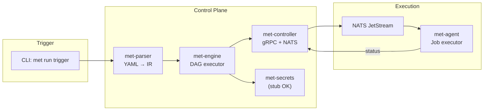

# Self-Hosting Milestone Plan

## Current State

Phase 0 (Foundation) is complete:

- Cargo workspace with 14 crates
- `met-core` with types, IDs, models, config, events
- `met-store` with migrations and repositories
- `met-proto` with gRPC definitions
- CI, docker-compose, justfile

## What Self-Hosting Requires

To run `cargo build && cargo test && cargo clippy` on itself, Meticulous needs:




## Critical Path (Minimum Viable)


| Order | Component                     | What's Needed                                          | Can Skip                                                                                    |
| ----- | ----------------------------- | ------------------------------------------------------ | ------------------------------------------------------------------------------------------- |
| 1     | Agent System (Phase 1)        | Agent binary, controller, NATS dispatch, job execution | K8s operator, per-job PKI (use plaintext initially), native backends (Linux container only) |
| 2     | Parser (Phase 2a)             | YAML parsing, schema validation, DAG construction      | TS/Python support, workflow resolution from DB                                              |
| 3     | Secrets (Phase 3)             | Broker trait + environment variable provider           | Vault, AWS SM, K8s integrations, OIDC                                                       |
| 4     | Engine (Phase 2b)             | DAG executor, NATS job dispatch, status tracking       | Caching, artifact passing, CEL conditions, retries                                          |
| 5     | CLI trigger (Phase 4b subset) | Single command: `met run trigger <pipeline.yaml>`      | Full CLI, API server, WebSocket streaming                                                   |


## Estimated Effort by Wave

### Wave 1 (can parallelize)

- **Agent binary + Controller**: ~3-4 sessions
  - gRPC registration/heartbeat
  - NATS connection and job pickup
  - Basic container execution (Linux)
  - Status reporting
- **Parser**: ~2 sessions
  - YAML deserialization with serde
  - Schema validation
  - DAG construction (Kahn's algorithm)
  - IR emission

### Wave 2 (sequential after Wave 1)

- **Secrets stub**: ~0.5 session
  - Trait definition
  - Environment variable provider
- **Engine core**: ~2-3 sessions
  - DAG executor loop
  - NATS job dispatch
  - Job completion handling
  - Database state persistence

### Wave 3 (final)

- **CLI trigger command**: ~0.5-1 session
  - Parse YAML file
  - Call engine to create run
  - Poll for completion, print status

## Self-Hosting Pipeline Definition

Once complete, we'd define `.stable/ci.yaml`:

```yaml
name: meticulous-ci
triggers:
  manual: {}
  
runs-on:
  tags: [linux, docker]

workflows:
  - name: Check
    id: check
    workflow: inline
    steps:
      - run: cargo check --workspace
      
  - name: Test
    id: test
    depends-on: [check]
    workflow: inline
    steps:
      - run: cargo test --workspace
      
  - name: Clippy
    id: clippy
    depends-on: [check]
    workflow: inline
    steps:
      - run: cargo clippy --workspace -- -D warnings
      
  - name: Format
    id: fmt
    workflow: inline
    steps:
      - run: cargo fmt --all -- --check
```

## Milestone Target

**Self-hosting milestone = Waves 1-3 complete**

After completing the critical path above, you could run:

```bash
# Start infrastructure
docker compose up -d

# Run migrations
just db-migrate

# Start controller (terminal 1)
cargo run --bin met-controller

# Start agent (terminal 2)  
cargo run --bin met-agent --join-token=dev

# Trigger the self-build (terminal 3)
cargo run --bin met -- run trigger .stable/ci.yaml
```

## What Gets Deferred

These are not needed for self-hosting but remain in the full plan:

- Web UI (Phase 5)
- API server beyond CLI needs
- WebSocket log streaming (CLI can poll)
- Caching layer
- Artifact passing between jobs
- Per-job PKI (use plaintext secrets initially)
- macOS/Windows native backends
- K8s operator
- SBOM generation
- Blast radius tracking
- OIDC authentication

## Recommendation

Start with **Wave 1** items in parallel:

1. One workstream on Agent + Controller
2. One workstream on Parser

This gets you to self-hosting in approximately **8-10 focused sessions** of work, assuming each session is a substantial block of coding time.