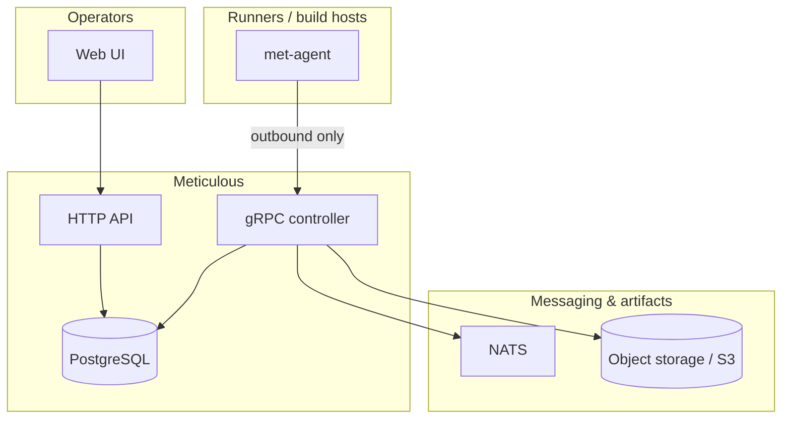

# Meticulous

> [!WARNING]
> **Major breaking changes are expected.** This project is under active development. APIs, protobuf contracts, database migrations, configuration, auth flows, and deployment layouts **will change in incompatible ways** as Meticulous evolves. Do not assume stability; plan for migrations and pinned versions if you build on top of this repo.

> [!CAUTION]
> **Not a finished product.** Behavior and security guarantees are still being shaped. Production use requires your own review, hardening, and operational discipline.

## What it is (short)

**Meticulous** is a **CI / release platform** built on one principle: **security above all else.** The goal is to help engineering teams and projects withstand the steady stream of **supply-chain attacks**—compromised dependencies, poisoned pipelines, stolen tokens, and everything else that sits between “commit” and “shipped.” Performance matters, but it is **not** the north star; **trust boundaries, verification, and safe defaults** are.

Under the hood this repo implements that idea with **outbound-only agents**, a **controller** (gRPC), an **HTTP API** and **web UI** on **PostgreSQL**, plus supporting pieces like **NATS** and **SeaweedFS** in typical dev stacks—wired so control stays explicit and enrollment and access stay intentional (e.g. join tokens, auth, RBAC).

## Architecture (at a glance)

**How to read it:** people use the **web UI** and **HTTP API** against the same **Postgres** metadata as the **controller**. **Agents** never accept inbound connections from the control plane; they **dial out** to the controller over **gRPC**. The controller uses **NATS** for messaging and **S3-compatible storage** (e.g. SeaweedFS in dev) for things like log archival and binary data, so secrets and policy stay on your side of the trust boundary as much as possible.