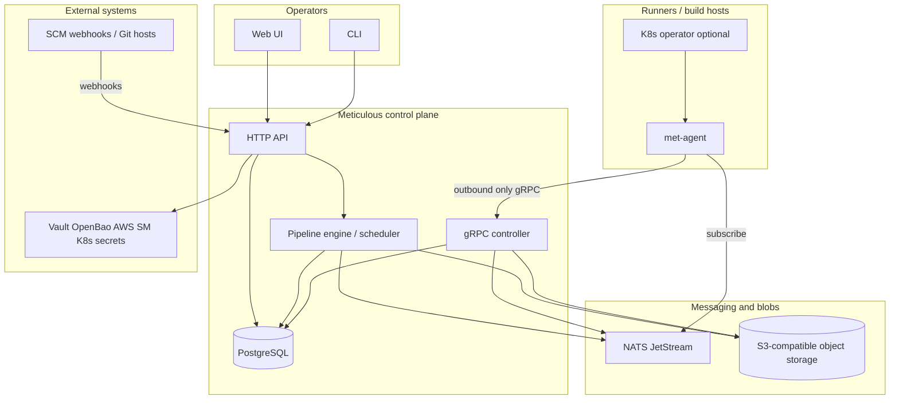

# Architecture

Meticulous is a **security-first CI and release platform**: operators use a web UI and HTTP API; work runs on **agents** that never accept inbound control-plane connections.

## System context



**Read path:** UI and API share Postgres metadata with the controller and engine. Agents **dial out** to the controller; they **consume jobs** from NATS subjects (e.g. pool tags). Object storage holds artifacts, large blobs, and log archives as policy allows. SCM sends webhooks to the API; secrets resolve through integrations, not long-lived secrets on runners by default.

## Major components

| Component                   | Role                                                                                                                          |
| --------------------------- | ----------------------------------------------------------------------------------------------------------------------------- |
| **HTTP API**                | CRUD for orgs, projects, pipelines, runs; auth; webhook ingress.                                                              |
| **Pipeline engine**         | Parse pipeline definitions, resolve DAGs and reusable workflows, schedule work, enforce preconditions (e.g. secrets present). |
| **Scheduler**               | Enqueue runs, map jobs to pool tags, coordinate with controller state.                                                        |
| **Agent controller**        | Registration, heartbeats, join tokens, revocation; job lifecycle signals with agents over gRPC.                               |
| **met-agent**               | Execute steps (containers on Linux; native where required), stream logs/status, apply per-job secret delivery.                |
| **met-operator** (optional) | Kubernetes-native agent pools: CRDs, scaling, pod lifecycle.                                                                  |
| **PostgreSQL**              | System of record for metadata, RBAC, run state, configuration.                                                                |
| **NATS JetStream**          | Durable work dispatch; agents need only egress.                                                                               |
| **Object storage**          | Artifacts, attestations, optional log segments; S3-compatible (e.g. SeaweedFS in dev).                                        |

## Domain model (summary)

```
Organization (tenant)
  └── Project (owner: user or group)
        ├── Pipelines
        │     ├── Jobs (DAG)
        │     │     └── Steps
        │     ├── Secrets (project or global scope)
        │     ├── Variables (project or global scope)
        │     └── Triggers (webhook, manual, tag, schedule)
        └── Reusable workflows
              ├── global/   (platform-wide, admin-curated)
              └── project/  (project-owned)
```

Pipelines reference workflows as `workflow: global/...` or `workflow: project/...` with an explicit **version**.

## Key design decisions

1. **Egress-only agents** — No inbound connections from the control plane to runners; reduces attack surface and firewall complexity.
2. **Pub/sub dispatch** — Pool-tag-scoped NATS subjects; scale agents horizontally; design for at-least-once delivery and idempotent job handling (operational detail to nail in implementation).
3. **Per-job PKI for secrets** — Short-lived job key material; control plane encrypts secret material for the agent; limits blast radius per run.
4. **Custom execution engine** — DAG, caching, artifacts, and composition live in-repo (not Tekton-as-the-engine); keeps policy and supply-chain features first-class.
5. **External secrets preferred** — Vault, OpenBao, AWS Secrets Manager, Kubernetes secrets as first-class; built-in secret storage discouraged in product direction.
6. **Reusable workflows** — Primary composition unit to reduce one-off pipeline sprawl.

## Cross-cutting concerns (target state)

| Concern                | Direction                                                                                       |
| ---------------------- | ----------------------------------------------------------------------------------------------- |
| **Observability**      | OpenTelemetry metrics/traces; structured logs; correlation from API through scheduler to agent. |
| **Logs**               | Stream to UI; archive to object storage where configured; redact secrets in all outputs.        |
| **Identity**           | OIDC/JWT for users; join tokens and mTLS or equivalent for agent enrollment per security plan.  |
| **Release management** | Later phase: promotion, approvals, notifications, rollback hooks (see `features.md`).           |

## Related docs

- Product requirements (PRDs): [prd/](prd/)
- Architecture decisions (ADRs): [adr/](adr/)
- Vision: [vision.md](vision.md)
- Non-functional constraints: [constraints.md](constraints.md)
- Feature backlog: [features.md](features.md)
- Pipeline examples and secret handling: [pipelines.md](pipelines.md)
- Open decisions: [open-questions.md](open-questions.md)
- Operations and reliability: [operations-and-reliability.md](operations-and-reliability.md)
- Canonical repo overview: [.github/readme.md](../.github/readme.md)
