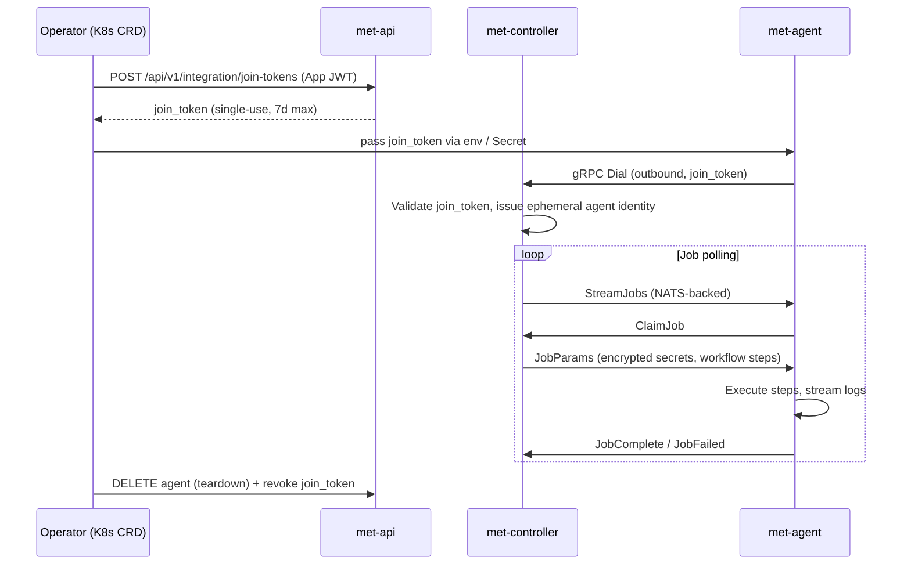

# Agent & controller

## Agent lifecycle



### Key properties

- **Outbound-only** — the agent dials the controller; no inbound port is opened on the agent host.
- **Single-use join tokens** — each agent bootstraps with a join token issued by the API. Tokens are hashed on storage (never plaintext). Single-use preferred; the Kubernetes operator revokes tokens on teardown.
- **Pool tags** — agents advertise capabilities via tags (e.g. `amd64: true`, `gpu: true`). The controller dispatches jobs only to agents whose tags satisfy the pipeline's `runs-on` selector.

---

## Per-job secrets

Secrets are **never decrypted once and stored on the agent**. Instead:

1. The controller generates a **one-time X.509-style keypair** for each job.
2. The public key is sent to the API, which encrypts each secret value to that key.
3. The encrypted payload is delivered to the agent as part of job parameters.
4. The agent decrypts using its private key, uses the secrets **in-memory only**, and the key material is discarded when the job completes.

This means:

- A compromised agent cannot re-use job key material after the job ends.
- Secret values are never in plaintext in the database, queue, or object storage.
- Revoking an API token or join token does not require rotating all secrets — only the delivery channel changes.

Meticulous supports **external secret stores** as the preferred source:

| Store | Config example |
|-------|----------------|
| AWS Secrets Manager | `aws.arn: arn:aws:secretsmanager:...` |
| HashiCorp Vault / OpenBao | `vault.path: secret/my-secret` |
| Kubernetes Secrets | `kubernetes.secret: my-k8s-secret` |
| Platform-stored (built-in) | `platform.name: MY_SECRET` |

External stores are preferred — secrets never transit the Meticulous control plane at all; only the ARN or path is stored.

---

## Kubernetes operator (agent fleet management)

The [Meticulous Agent Runner Controller](https://github.com/getmeticulous/Meticulous-Agent-Runner-Controller) is a Kubernetes operator that manages agent fleets declaratively:

```
MeticulousAgentDeployment
  └── MeticulousAgentReplicaSet
        └── MeticulousAgent → Pod + join-token Secret
```

See [Deploying with Kubernetes](../operator/install.md) for full setup instructions.
