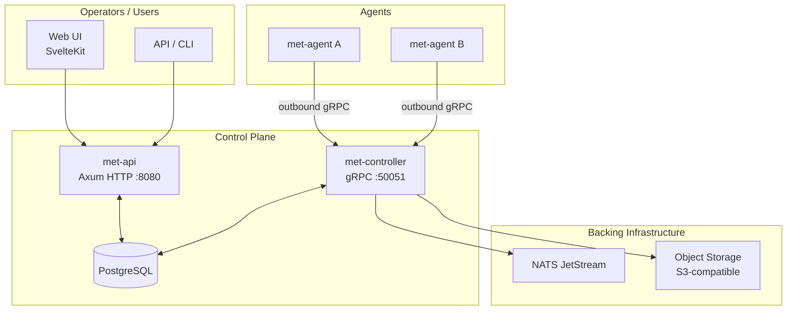
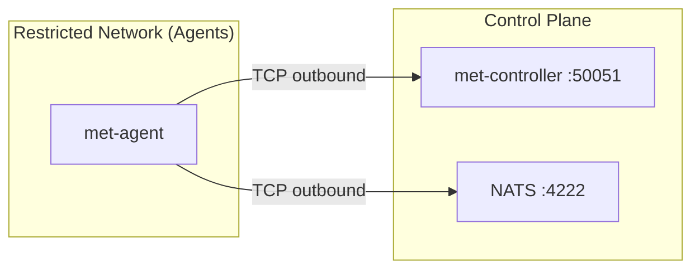

# Architecture overview

## System components



### met-api

The HTTP REST API (Axum). Handles all user-facing operations: authentication, project management, pipeline CRUD, run triggering, secret management, and webhook ingestion. Serves the Swagger UI at [`/api/docs`](/api/docs) and the machine-readable OpenAPI spec at [`/api/v1/openapi.json`](/api/v1/openapi.json).

### met-controller

gRPC server that agents dial into. Manages job dispatch, workspace snapshots, per-job key material, artifact coordination, and NATS integration. Agents never connect to the HTTP API; the controller is the only inbound surface for agent traffic.

### NATS JetStream

Work-queue backbone. The controller publishes jobs to pool-tag-scoped subjects; agents subscribe and acknowledge. JetStream provides durability (replayed on agent crash) and back-pressure without a separate queue server.

### Object storage (S3-compatible)

Artifacts, workspace snapshots, and SBOM attestations. Meticulous is tested with SeaweedFS (self-hosted) and AWS S3; any S3-compatible backend works.

---

## Domain hierarchy

```
Organization (tenant)
  └── Project
        ├── Pipeline (YAML, triggers, DAG of workflow invocations)
        │     ├── Job (one workflow invocation expanded per matrix row)
        │     │     └── Step (command or built-in action)
        │     ├── Secrets (project or global scope)
        │     ├── Variables (project or global scope)
        │     └── Triggers (webhook, manual, tag, schedule)
        └── Reusable Workflows (project-scoped or global/platform)
```

### Reusable workflows: global vs project

- **`global/`** — platform-wide, admin-managed, versioned centrally. Pipelines reference them as `workflow: global/docker-build`.
- **`project/`** — owned by a project, versioned per project. Referenced as `workflow: project/my-workflow`.

---

## Networking model

Agents only need **egress** to the controller gRPC port and NATS. There is no inbound listening port on the agent process. This means agents can run in airgapped networks, behind strict egress firewalls, or in environments where accepting inbound connections is prohibited.



See [Pipeline model](pipeline-model.md) for how jobs are scheduled and [Agents & Controller](agents.md) for the gRPC protocol.
