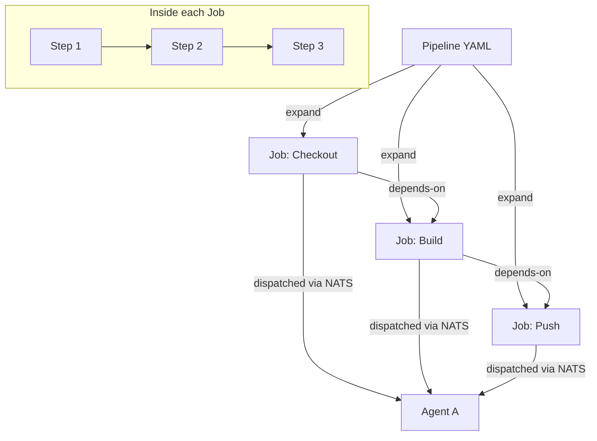

# Pipeline model

A Meticulous pipeline is a YAML file (`.stable/pipeline-*.yaml`) that declares **what to run**, **when to run it**, and **on what kind of agent**. Pipelines compose versioned **reusable workflows** rather than embedding ad-hoc shell scripts directly.

---

## Anatomy of a pipeline

```yaml
# .stable/pipeline-docker-build.yaml
name: Docker build and push

triggers:
  release:
    tag:
      - "v*"
  manual: {}

runs-on:
  tags:
    - amd64: true

secrets:
  DOCKER_PASSWORD:
    aws:
      arn: arn:aws:secretsmanager:us-east-1:123456789012:secret:prod/docker-password

vars:
  REGISTRY: ghcr.io/example-org
  IMAGE: my-app

workflows:
  - name: Checkout
    id: checkout
    workflow: global/git-checkout
    version: v1.0
    inputs:
      repo: https://github.com/example-org/my-app.git
    depends-on: []

  - name: Build
    id: build
    workflow: global/docker-build
    version: v0.2
    inputs:
      image_tag: "${REGISTRY}/${IMAGE}"
    depends-on: [checkout]

  - name: Push
    id: push
    workflow: global/docker-push
    version: v0.2
    inputs:
      image_tag: "${REGISTRY}/${IMAGE}"
      docker_password: "${DOCKER_PASSWORD}"
    depends-on: [build]
```

---

## Execution model



1. **Trigger** — webhook push, tag, manual, or schedule hits the API.
2. **Expansion** — the controller reads the pipeline YAML, resolves workflow versions, and expands matrix rows into individual jobs forming a DAG.
3. **Dispatch** — each job is published to a NATS subject scoped to the pool tags declared in `runs-on`. Agents subscribe to matching subjects and claim jobs.
4. **Execution** — the agent pulls job parameters (including encrypted secrets), runs steps sequentially, and streams logs back. Artifacts are uploaded to object storage.
5. **DAG coordination** — the controller tracks job completion and releases downstream jobs as their `depends-on` predecessors succeed.

---

## Reusable workflows vs GitHub Actions

GitHub Actions lets any pipeline reference actions from arbitrary Git repositories by SHA, branch, or tag:

```yaml
# GitHub Actions — any Git ref, any repo
- uses: actions/checkout@v4
- uses: some-org/some-action@main   # ← points at a branch
```

Meticulous workflows are **versioned by the platform**, not by a Git ref:

```yaml
# Meticulous — platform-managed, versioned registry
workflow: global/git-checkout
version: v1.0
```

- Versions are explicit strings stored in the platform's workflow catalog, not floating Git refs.
- `global/` workflows are admin-controlled; a developer cannot silently pin to a compromised commit.
- Supply chain risk is centralized: auditing or updating a workflow version is a platform-level operation, not a per-pipeline change across hundreds of repos.

---

## Workspace sharing across jobs

Pipeline-level `agent-affinity` with `share-workspace: true` lets a chain of jobs share filesystem state on the same agent. Meticulous also supports **passive S3 snapshots**: each job captures a `tar.zst` of its workspace on success; the next job restores it. This works across agents — no sticky scheduling required.

```yaml
agent-affinity:
  share-workspace: true

workflows:
  - id: checkout
    workflow: global/git-checkout
    version: v1.0
    workspace:
      outputs: ["src/"]          # only snapshot src/ to keep archive small

  - id: build
    workflow: global/docker-build
    version: v0.2
    workspace:
      from: checkout             # restore checkout's snapshot before running
    depends-on: [checkout]
```
