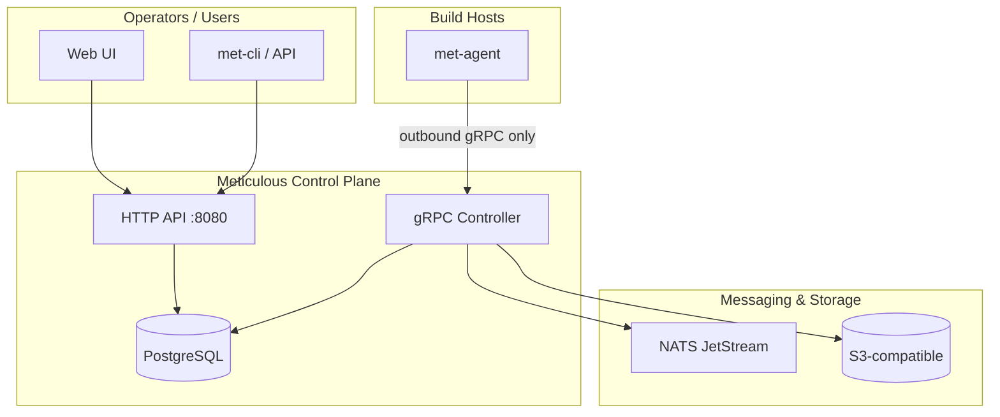

# Meticulous

**Meticulous** is a self-hosted CI/CD platform built around three ideas:

- **Egress-only agents** — build workers never accept inbound connections; they dial out to the controller. No punched holes in your network.
- **Per-job secrets** — secret material is encrypted to a one-time key scoped to a single job run, then discarded. Secrets are never in plaintext on the wire or in shared storage.
- **Versioned, composable workflows** — pipelines reference reusable workflows at a pinned version, not arbitrary code from a Git ref.

---

## How it fits together

The control plane (API + controller + PostgreSQL) lives in your cluster or cloud account. Agents run wherever your builds need to run — VMs, bare metal, containers — and connect **outbound only**. There is no inbound attack surface on the agent network.

---

## Key concepts

| Concept | Description |
|---------|-------------|
| **Organization** | Top-level tenant. Users, groups, billing, and global settings live here. |
| **Project** | Container for pipelines, secrets, variables, webhooks, and reusable workflows. |
| **Pipeline** | A YAML-defined DAG of workflow invocations, with triggers (push, tag, manual, schedule). |
| **Reusable workflow** | A versioned, reusable unit of work — global (platform) or project-scoped. Pipelines compose workflows, not ad-hoc scripts. |
| **Job** | One expanded workflow invocation; the unit the scheduler dispatches to an agent. |
| **Step** | An individual command or action inside a job. |
| **Agent** | A compute host running `met-agent`. Subscribes to NATS for jobs matching its pool tags. |

---

## What's in this documentation

| Section | Contents |
|---------|----------|
| [Architecture](architecture/overview.md) | System diagram, pipeline model, agent/controller boundary |
| [Comparison](comparison/github-actions.md) | How Meticulous differs from GitHub Actions, GitLab CI, and Jenkins |
| [Security](security/model.md) | Security model, join tokens, per-job secrets |
| [API](api/reference.md) | REST API, Swagger UI, OpenAPI JSON |
| [Authentication](api/authentication.md) | Bearer tokens, API tokens, Meticulous Apps / JWTs |
| [Operator](operator/install.md) | Kubernetes operator install, prerequisites, CRDs |
