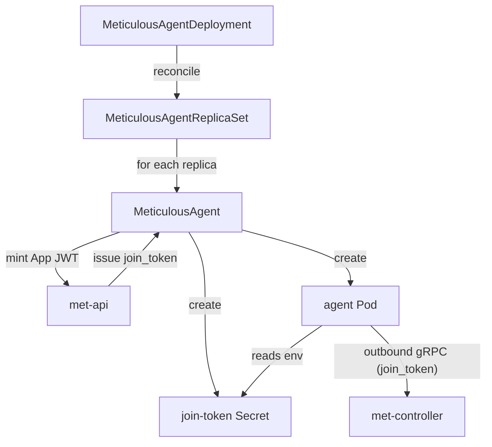

# Deploying with Kubernetes

The **Meticulous Agent Runner Controller** is a Kubernetes operator that manages agent fleets declaratively. It provisions `MeticulousAgent` pods, handles join-token issuance and revocation, and keeps agent replica counts reconciled.

---

## Prerequisites

1. **Meticulous control plane** running with migration `027` applied (`meticulous_apps` tables).
2. **A Meticulous App** created in the admin UI (`/admin/apps`) or via the admin API.
3. **An app installation** on the target project (admin UI → Apps → Install).
4. **`agents:delete` permission** granted on the installation (admin UI checkbox or API).
5. Cluster **egress** from agent pods to:
   - `met-controller` gRPC port (default `:50051`)
   - NATS port (default `:4222`)
   - Meticulous HTTP API (for join-token management)
   - Container registries and any URLs used by build steps

---

## Install the operator

```bash
# Apply CRDs and operator deployment
kubectl apply -f https://github.com/getmeticulous/Meticulous-Agent-Runner-Controller/releases/latest/download/install.yaml
```

Or use Helm (if available):

```bash
helm repo add meticulous https://charts.getmeticulous.io
helm install meticulous-operator meticulous/agent-runner-controller \
  --namespace meticulous-operator \
  --create-namespace
```

---

## Create the app private key Secret

```bash
# Generate an RSA-4096 private key
openssl genpkey -algorithm RSA -pkeyopt rsa_keygen_bits:4096 -out private_key.pem

# Store in Kubernetes — never commit the PEM to source control
kubectl create secret generic meticulous-app-key \
  --namespace meticulous \
  --from-file=private_key.pem=private_key.pem

rm private_key.pem
```

---

## Deploy a MeticulousAgentDeployment

```yaml
apiVersion: meticulous.io/v1alpha1
kind: MeticulousAgentDeployment
metadata:
  name: build-agents
  namespace: meticulous
spec:
  replicas: 3

  meticulousApiBaseUrl: https://ci.example.com

  meticulousAppAuth:
    applicationId: "01HXYZ..."       # Meticulous App ID
    installationId: "01HABC..."      # Installation ID on the target project
    keyId: "my-key-2026-04"          # kid matching the registered public key
    privateKeySecret:
      name: meticulous-app-key
      key: private_key.pem

  agentTemplate:
    spec:
      image:
        repository: harbor.example.com/meticulous/met-agent
        tag: latest
      poolTags:
        amd64: "true"
      resources:
        requests:
          cpu: "1"
          memory: 2Gi
        limits:
          cpu: "4"
          memory: 8Gi
```

Apply it:

```bash
kubectl apply -f meticulous-agent-deployment.yaml
```

---

## How the operator works



1. The operator mints a short-lived **App JWT** (8-minute TTL) and calls `POST /api/v1/integration/join-tokens`.
2. The join token is stored in a Kubernetes Secret mounted into the agent Pod.
3. The Pod starts, presents the join token to `met-controller`, and registers as an available agent.
4. On deletion of a `MeticulousAgent`, the operator calls the API to revoke the join token and soft-delete the agent record.

---

## Scaling

```bash
kubectl patch meticulousagentdeployment build-agents \
  --namespace meticulous \
  --type=merge \
  -p '{"spec":{"replicas":10}}'
```

The operator reconciles to the desired count, issuing new join tokens for additional agents and revoking tokens for removed agents.

---

## Troubleshooting

| Symptom | Likely cause | Action |
|---------|-------------|--------|
| Agent Pod starts but never picks up jobs | Pool tags mismatch between agent and pipeline `runs-on` | Verify `poolTags` vs pipeline `runs-on.tags` |
| `401 Unauthorized` on join-token endpoint | App JWT expired or wrong `kid` | Check clock skew; verify `keyId` matches a registered key |
| Agent immediately exits | Join token already consumed (duplicate use) | Ensure `replicas` matches actual Pod count; check for stale tokens |
| `403 Forbidden` on agent deletion | Missing `agents:delete` permission on installation | Grant permission in admin UI → Apps → Installation |
