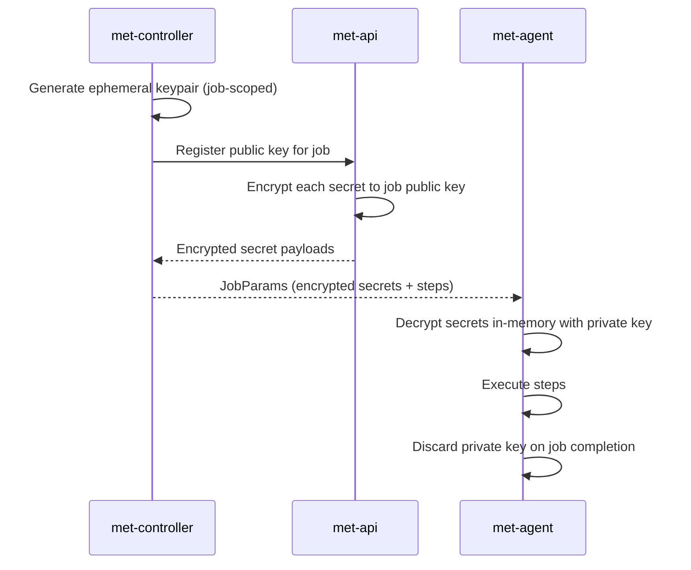

# Security model

Meticulous is designed with the assumption that **any component can be compromised** and damage should be limited to the smallest possible blast radius.

---

## Threat model summary

| Threat | Mitigation |
|--------|------------|
| Compromised agent host | Job key material scoped to one run; expires on completion. No cross-job or cross-tenant data accessible. |
| Intercepted NATS message | Secrets are encrypted to the job-specific public key; ciphertext on the wire cannot be decrypted without the agent's private key. |
| Stolen join token | Tokens are single-use; operator revokes on agent teardown. Hashed on storage — raw value never in DB. |
| Malicious pipeline YAML | YAML is declarative; no arbitrary code runs in the control plane. Workflow steps are admin-controlled catalog entries. |
| Supply chain attack on workflows | Workflows are versioned in the platform catalog; developers cannot reference arbitrary external code. |
| Leaked API token | Tokens are scoped (`pipelines:read`, `runs:trigger`, etc.); `*` wildcard restricted to service accounts. 90-day expiry with rotation reminders. |

---

## Join tokens

When an agent starts, it presents a **join token** to the controller. Join tokens:

- Are issued by the API (`POST /api/v1/integration/join-tokens`) to authenticated callers with the `join_tokens:create` scope.
- Are **single-use** — the controller marks the token consumed on first use. Re-use is rejected.
- Are stored as a **hash** (never plaintext) in the database.
- Have a **7-day default TTL** (30-day maximum requires explicit operator opt-in).
- Can be revoked by an authenticated caller with `join_tokens:revoke` scope.

The Kubernetes operator automatically revokes join tokens when a `MeticulousAgent` resource is deleted.

---

## Per-job key material

Key properties:

- The private key **never leaves the agent** and is **never stored**.
- Secret ciphertext in NATS or object storage cannot be decrypted without the agent's ephemeral private key.
- A job that crashes mid-run cannot be replayed by an attacker who only has the encrypted payload.

---

## RBAC and scoped API tokens

Access is enforced at the resource level, not just the endpoint level:

| Role | Scope | Capabilities |
|------|-------|-------------|
| `platform_admin` | Global | Full control; global workflow management, agent management |
| `org_admin` | Organization | Org settings, user/group management, org-level secrets |
| `project_admin` | Project | Pipeline management, project secrets, variables |
| `developer` | Project | Trigger runs, view logs, read pipelines, manage own tokens |
| `viewer` | Project | Read-only: runs, logs, pipeline definitions |

API tokens carry **explicit scopes** (e.g. `pipelines:read`, `runs:trigger`). Wildcard `*` is reserved for service accounts and automation; it should not be assigned to human users in production.

---

## Audit log

All auth events, token operations, secret accesses, and permission changes are written to an append-only `audit_log` table in PostgreSQL. The schema is aligned with [OCSF](https://schema.ocsf.io/) event classes for SIEM integration.

Events include:
- `auth.login` / `auth.logout`
- `token.created` / `token.revoked`
- `secret.accessed` / `secret.modified`
- `permission.changed`
- `run.triggered` / `run.cancelled`

---

## Webhook security

Webhooks from GitHub, GitLab, and Bitbucket are validated using HMAC signatures before any processing:

| SCM | Header | Algorithm |
|-----|--------|-----------|
| GitHub | `X-Hub-Signature-256` | HMAC-SHA256 |
| GitLab | `X-Gitlab-Token` | constant-time comparison |
| Bitbucket | `X-Hub-Signature` | HMAC-SHA256 |

Generic webhooks support HMAC-SHA256 with a shared secret configured per registration.
