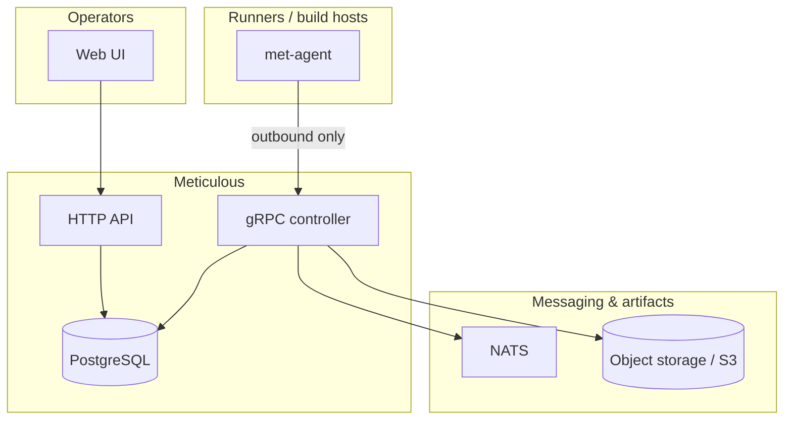

# System diagram and domain

## Architecture (at a glance)

Aligned with [.github/readme.md](../../../.github/readme.md):



**Reading order:** UI and API share Postgres metadata with the controller. Agents open outbound gRPC to the controller. The controller uses NATS and object storage so policy and secrets handling stay explicit.

## Core hierarchy

```
Organization/Tenant
  └── Project (owner: user or group)
        ├── Pipelines
        │     ├── Jobs (DAG units)
        │     │     └── Steps
        │     ├── Secrets (project or global scope)
        │     ├── Variables (project or global scope)
        │     └── Triggers (webhook, manual, tag, schedule)
        └── Reusable Workflows (project-scoped or global)
```

Reusable workflows: **`global/`** (platform-wide, admin-managed) vs **`project/`** (project-owned). Pipelines reference them as `workflow: global/...` or `workflow: project/...`.

## Key design decisions (expanded)

1. **Pub/Sub for job dispatch** — Pool-tag-scoped NATS subjects; agents only need egress.
2. **Per-job PKI for secrets** — One-time X509-style job keys; server encrypts secret material to the agent public key; scoped to a single job run.
3. **Custom execution engine** — DAG resolution, orchestration, caching, artifact passing in-repo; Linux containers vs native execution on other OSes as applicable.
4. **Reusable workflows as composition unit** — Versioned workflows reduce one-off pipeline sprawl.
5. **External secrets preferred** — Vault/OpenBao, AWS Secrets Manager, K8s secrets as first-class; built-in secret storage de-emphasized in product direction.

## Master plan source

Full narrative and alternate diagrams: [.cursor/plans/master_architecture_4bf1d365.plan.md](../../../.cursor/plans/master_architecture_4bf1d365.plan.md). Note: older “React/Vite” mentions there are stale; the implemented UI is SvelteKit.
